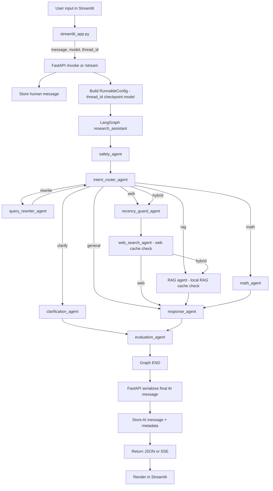

# Agent Input-to-Output Flow

This flowchart matches the current codebase behavior (`agent/research_assistant.py`, `service/service.py`, `streamlit_app.py`).

## Notes

- `clarification_agent` does not continue to `response_agent` in the same run.
- Clarified user reply comes as a new turn and is routed again by `intent_router_agent`.
- `local:` prefix forces the RAG route.
- Web/RAG cache checks happen inside `web_search_agent` / `rag_agent` internals (Redis or in-memory fallback).
- UI shows a cache footer only on cache hits (e.g., `Cache: web via memory cache`).
