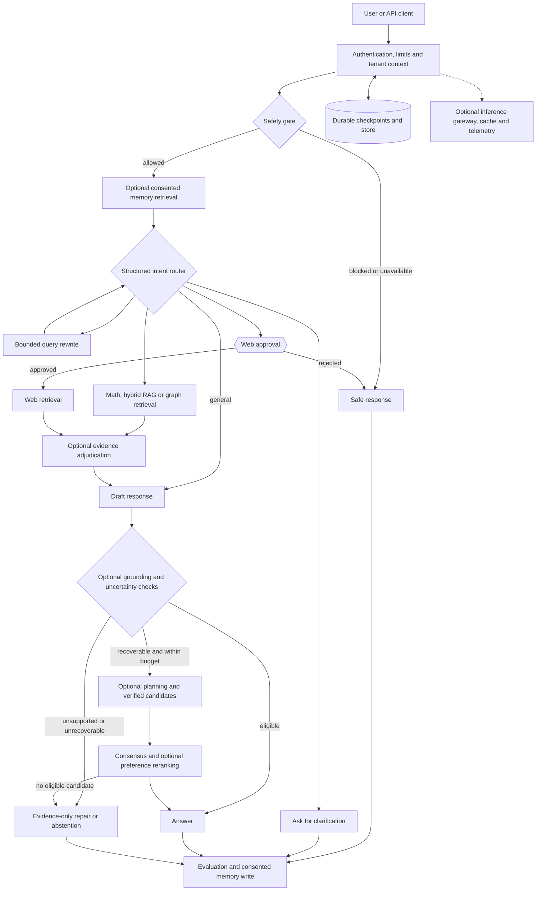
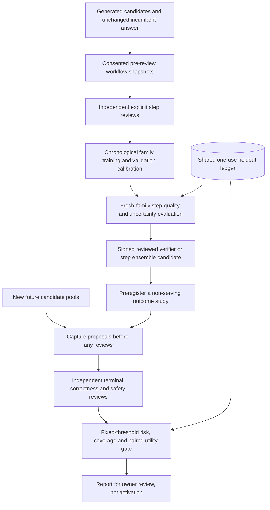
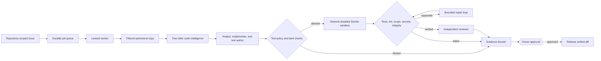

# AgentForge

A reliability-first platform for building, evaluating, and operating AI agents.

[](https://github.com/Theepankumargandhi/Multi-Agent-Orchestration/actions/workflows/ci.yml)
[](https://github.com/Theepankumargandhi/Multi-Agent-Orchestration/actions/workflows/cd-release.yml)

AgentForge began as a LangGraph research assistant. It has grown into a practical AI-engineering platform that answers a harder question: *how do you let an agent use retrieval, memory, tools, and additional inference without silently releasing an unsafe or unsupported answer?*

The repository contains two working agent systems:

- an evidence-aware research agent with hybrid RAG, durable human approval, memory, grounding, calibrated uncertainty, and adaptive test-time compute;
- a sandboxed coding agent that retrieves repository context, proposes a patch, tests it in an isolated container, and produces a reviewable evidence dossier without modifying the source repository.

Around those agents are an inference gateway, evaluation suites, adversarial testing, trace-based observability, release gates, persistence, and FastAPI, Docker, and Kubernetes deployment assets. These are reference implementations, not a claim that the repository is ready for unrestricted production traffic.

> This is not presented as a production factuality guarantee or an official benchmark result. The checked-in evaluations are reproducible engineering evidence; the [limitations](#what-the-results-do-not-claim) explain where human-labelled and live-model validation is still required.

## Why this project exists

Most agent demos stop after the model produces a plausible answer. AgentForge treats generation as the middle of the workflow, not the end.

A request may need to be rejected by a safety policy, clarified, routed to a tool, approved by a person, grounded in several sources, repaired, or withheld when confidence is too low. Each of those decisions must be observable and testable. AgentForge makes those decisions explicit in the graph and attaches evaluation evidence to them.

That makes the project useful for demonstrating the work expected from an AI engineer:

- designing agent workflows rather than a single prompt;
- building and measuring retrieval systems;
- controlling hallucination, uncertainty, cost, and tool risk;
- evaluating complete trajectories, not only final text;
- operating model calls behind stable service boundaries;
- shipping with tests, telemetry, persistence, and deployment controls.

## System at a glance

The research workflow is an 18-node LangGraph state machine. This diagram groups the stages for readability; optional controls are shown where they operate, not as features that are all enabled by default.


```mermaid
flowchart TD
    Client[User or API client] --> API[Authentication, limits and tenant context]
    API --> Safety{Safety gate}
    Safety -->|blocked or unavailable| Safe[Safe response]
    Safety -->|allowed| Memory[Optional consented memory retrieval]
    Memory --> Router{Structured intent router}
    Router --> Clarify[Ask for clarification]
    Router --> Rewrite[Bounded query rewrite]
    Rewrite --> Router
    Router --> Tools[Math, hybrid RAG or graph retrieval]
    Router --> Approval{{Web approval}}
    Router -->|general| Draft[Draft response]
    Approval -->|approved| Web[Web retrieval]
    Approval -->|rejected| Safe
    Tools --> Evidence[Optional evidence adjudication]
    Web --> Evidence
    Evidence --> Draft
    Draft --> Gate{Optional grounding and uncertainty checks}
    Gate -->|eligible| Result[Answer]
    Gate -->|unsupported or unrecoverable| Repair[Evidence-only repair or abstention]
    Gate -->|recoverable and within budget| Compute[Optional planning and verified candidates]
    Compute --> Select[Consensus and optional preference reranking]
    Select --> Result
    Select -->|no eligible candidate| Repair
    Safe --> Finish[Evaluation and consented memory write]
    Clarify --> Finish
    Result --> Finish
    Repair --> Finish
    API <--> State[(Durable checkpoints and store)]
    API -.-> Ops[Optional inference gateway, cache and telemetry]
```

Native LangGraph interrupts persist web-approval state in the checkpointer, so an approval can survive an API restart when persistent checkpointing is configured. Repair is evidence-only trimming or abstention, not an unchecked second model answer. Query rewriting returns to routing; the full graph includes hybrid retrieval and fallback paths omitted from this overview.

The line-by-line graph description lives in [the runtime flow](docs/architecture/agent_runtime_flow.md), and important trade-offs are recorded as [architecture decisions](docs/architecture/decisions.md).

## What is implemented

| Area | What the implementation demonstrates |
|---|---|
| Agent orchestration | Typed LangGraph state, structured routing, clarification, bounded repair, native interrupts, and route-scoped evidence |
| Retrieval | Semantic chunking, deterministic document IDs, vector + BM25 fusion, reranking, graph predicates, multi-hop retrieval, hard-negative learning-to-rank, caching, and retrieval ablations |
| Evidence intelligence | Prompt-injection quarantine, source-independence checks, cross-domain duplicate detection, freshness policy, and numeric/negation conflict graphs |
| Trustworthy generation | Claim-to-evidence alignment, citation allowlisting, high-risk thresholds, conformal selective answering, and fail-closed abstention |
| Test-time compute | Confidence-aware early exit, offline-RL or search-distilled PUCT priors, learned action-conditioned world-model rollouts, calibrated PRM ensembles, uncertainty penalties, OOD fallback/abstention, active learning, and measured quality/compute curves |
| Execution-to-learning loop | Consented content-free candidate observations, keyed tenant isolation, immutable delayed labels, request-grouped calibration/test splits, coverage/risk gates, and candidate-only recalibration |
| Prospective AI validation | Pre-execution task-family IDs, frozen chronological cohorts, embargo and label-availability cutoffs, one-use family exposure tracking, live-lineage checks, distribution-shift holds, and paired bootstrap comparisons |
| Preference learning | Human-reviewed candidate pairs, family-bootstrap Bradley–Terry metadata reward models, training-only feature scaling, conservative margin/OOD fallback, tenant-bound artifacts, safety-gated runtime reranking, and future-family evaluation |
| Controlled AI rollout | Preregistered non-serving selector comparisons, actual PRM/release eligibility snapshots, disagreement plus audit review, missing-label sensitivity bounds, fresh-family holdout gates, and optional expiring model/policy/scope-bound approvals |
| Post-activation preference control | Optional tenant-scoped signed deployment revisions, live approval-source checks, atomic serving provenance, fixed review deadlines, family-deduplicated sequential error monitoring, immediate reviewed-unsafe holds, and irreversible-per-approval baseline rollback |
| Reviewed workflow supervision | Frozen runtime workflow features, independent immutable step annotations, explicit-label-only PRM training, chronological family splits, validation-only temperature calibration, constant/weak-credit ablations, and conservative missing-review gates |
| Verifier outcome validation | Preregistered non-serving PRM comparisons using the actual selector, unchanged eligibility, retained abstentions, descriptive risk/coverage curves, fixed primary thresholds, paired terminal-utility bounds, and source-revocation checks |
| Reviewed verifier uncertainty | Whole-family bootstrap step ensembles, explicit labels only, validation-calibrated member predictions, training-feature support guards, missing-review-aware family-macro risk/coverage curves, single-model ablation, and signed offline candidates |
| Step-to-answer validation | Conservative step-correctness ranking heuristic, all-step deferral, prospective guarded/unguarded same-pool answer shadows, independent terminal reviews, retained abstentions, fresh-family outcome gates, and unchanged serving behavior |
| Long-term memory | Episodic, semantic, preference, and procedural memory with consent, tenant isolation, provenance, TTLs, corrections, deletion, and poisoning controls |
| Model operations | Tenant budgets, provider deadlines, circuit breakers, fallback, isolated semantic caching, constrained contextual-bandit routing, canaries, shadow evaluation, and online rollback decisions |
| Evaluation | Versioned datasets, fingerprints, trace replay, confidence intervals, failure slices, Pareto analysis, human-review provenance, adversarial arenas, and CI gates |
| Observability | Content-free OpenTelemetry GenAI spans, Prometheus metrics, LangSmith hooks, request/node latency, privacy checks, and reliability fault injection |
| Deployment | FastAPI + SSE, PostgreSQL/SQLite, Redis, Docker Compose, non-root containers, health checks, Kubernetes manifests, and network policy |

When enabled, evidence adjudication filters suspicious or redundant material before synthesis, grounding checks claims afterward, and calibrated uncertainty can withhold an answer. Adaptive compute spends extra inference only within its configured budget. These mechanisms have dependencies and mode restrictions; enabling every flag is not a supported setup recipe.

### What runs, and what is still an experiment?

The basic application provides research routing, retrieval, web approval, and API/UI serving. Memory, the inference gateway, evidence/grounding gates, uncertainty calibration, adaptive compute, learned planning, coding execution, and learning observers are opt-in. Artifact-dependent controls also need the matching model/calibrator and private integrity keys. See [.env.example](.env.example) for the complete configuration.

The latest work closes the gap between predicting a reviewed workflow step and selecting a good final answer:


```mermaid
flowchart TD
    Pool[Generated candidates and unchanged incumbent answer] --> Snap[Consented pre-review workflow snapshots]
    Snap --> Labels[Independent explicit step reviews]
    Labels --> Fit[Chronological family training and validation calibration]
    Fit --> StepGate[Fresh-family step-quality and uncertainty evaluation]
    StepGate --> Candidate[Signed reviewed verifier or step ensemble candidate]
    Candidate --> Register[Preregister a non-serving outcome study]
    Future[New future candidate pools] --> Compare[Capture proposals before any reviews]
    Register --> Compare
    Compare --> Outcomes[Independent terminal correctness and safety reviews]
    Outcomes --> Gate[Fixed-threshold risk, coverage and paired utility gate]
    Ledger[(Shared one-use holdout ledger)] --> StepGate
    Ledger --> Gate
    Gate --> Review[Report for owner review, not activation]
```

Workflow steps are typed views of grounding metadata, not captured hidden reasoning. Step ensembles use explicit labels, whole-family bootstrap sampling, validation-only calibration, and training-feature support guards. The step-to-answer adapter requires every step to be supported, accepted, and predicted correct; its minimum penalized score is a ranking heuristic, not a calibrated answer-correctness probability.

Verifier and ensemble-outcome shadows leave the served answer unchanged and make no extra LLM calls, though they add local scoring/storage work. They require replay consent, process snapshots, a registered study, and `PREFERENCE_RANKING_ENABLED=false`. Reviewed step ensembles have no serving activation path. A passing real outcome report means only `ready_for_owner_review`; a synthetic drill pass proves control behavior, not production readiness.

Preference reranking has a separate optional owner-activated deployment registry. Its live guard checks lineage and delayed outcomes at admission and can revert to the baseline. That capability does not activate reviewed step ensembles or outcome-shadow candidates. Prefer the subsystem guides over mixing these modes.

## Sandboxed coding agent

The coding workflow is deliberately separated from the research graph because code execution has a different risk model.


```mermaid
flowchart LR
    Issue[Repository-scoped issue] --> Queue[Durable job queue]
    Queue --> Lease[Leased worker]
    Lease --> Copy[Filtered ephemeral copy]
    Copy --> Context[Tree-sitter code intelligence]
    Context --> Roles[Analyst, implementer, and test author]
    Roles --> Policy{Tool policy and taint checks}
    Policy -->|denied| Dossier[Evidence dossier]
    Policy -->|allowed| Sandbox[Network-disabled Docker sandbox]
    Sandbox --> Verify{Tests, lint, scope, secrets, integrity}
    Verify -->|repairable| Repair[Bounded repair loop]
    Repair --> Verify
    Verify -->|failed| Dossier
    Verify -->|verified| Review[Independent reviewer]
    Review --> Dossier
    Dossier --> Owner{{Owner approval}}
    Owner -->|approved| Patch[Release unified diff]
```

Code intelligence uses Tree-sitter for Python, TypeScript, JavaScript, Java, Go, and Rust, including unchanged-file reuse and incremental reparsing. A decomposed query searches symbols, files, tests, and dependencies using BM25, embedding similarity, graph propagation, and reranking. The credential-free defaults are hashing embeddings and a feature reranker; learned Sentence Transformers and cross-encoder adapters require optional dependencies and model loading. Hard-negative mining trains an integrity-sealed pairwise fusion model, with optional bi-encoder and cross-encoder fine-tuning. Context is deduplicated, compressed to an approximate token budget, and accompanied by provenance receipts. Parser coverage is not a promise of six-language execution support: the supplied sandbox image contains Python tools.

The worker never edits the original repository. It operates on a filtered temporary copy and executes tests inside a non-root container with no network, a read-only root filesystem, dropped capabilities, and CPU, memory, PID, and time limits. Jobs are transactional and recoverable: submissions are deduplicated, workers hold expiring leases, abandoned jobs can be reclaimed, and completed artifacts are checked by digest.

See [the coding-agent design](docs/code-agent.md), [code intelligence](docs/code-intelligence.md), and [coding-agent evaluation](docs/coding-agent-evaluation.md).

## Evaluation evidence

There are 478 collected test cases. The last full local regression run for implementation commit `504b712` finished with 476 passed and two Docker-dependent tests skipped because the local engine/image was unavailable. Collection was rechecked during this documentation update; that is not a new full execution result.

CI runs on Python 3.11, builds the coding sandbox, executes pytest with coverage, and runs offline control gates, Ruff, dependency auditing, and container build checks. The configured coverage minimum is 30%, not a test-count floor. CI uploads coverage and evaluation artifacts; inspect the run before claiming those checks passed on a particular commit.

The table records historical focused branch-coverage measurements, not whole-project coverage or live-model quality. The latest step-to-answer measurement is documented in [its validation guide](docs/ensemble-outcome-validation.md).

| Module | Focused coverage |
|---|---:|
| Adaptive test-time compute | 94% |
| Verifier-guided search | 93% |
| Calibrated verifier ensemble | 90% |
| Reviewed step ensemble + offline evaluator (combined) | 96% |
| Step-to-answer adapter + outcome control runner (combined) | 98% |
| Evidence quality | 97% |
| Conformal uncertainty | 95% |
| Grounding verification | 94% |
| Inference gateway | 94% |
| Agent memory | 92% |
| Online quality controller | 89% |

The deterministic evaluation suites cover more than happy-path output. They exercise evidence injection, copied-source laundering, stale and contradictory evidence, fabricated citations, unsafe high-risk claims, calibration drift, compute-budget violations, process-level reward failures, unsafe trajectory selection, cross-tenant memory access, poisoning, provider failures, cache isolation, canary rollback, contextual-policy support and propensity errors, unsafe tool calls, worker-lease recovery, artifact tampering, and retrieval regressions.

After installing the development dependencies below, run a subset of the checks used in CI:

```bash
python -m pytest -q --cov --cov-report=term-missing --cov-report=xml
python -m evals.run_offline_evals --min-score 0.95
python -m evals.run_experiments --no-store --min-score 0.95
python -m code_agent.context_evaluation --repository-root . --top-k 8 --min-recall 0.90
python -m evals.contextual_bandit evals/datasets/contextual_bandit_feedback.jsonl --require-promotion
python -m evals.process_reward_evaluation evals/datasets/process_reward_trajectories.jsonl --require-promotion
python -m evals.search_planning_evaluation --check evals/experiments/search_planning.report.json --require-promotion
python -m evals.verifier_uncertainty_evaluation --check-artifact evals/experiments/process_reward_ensemble.json --check-report evals/experiments/verifier_uncertainty.report.json --require-promotion
python -m evals.world_model_evaluation --require-promotion
python -m evals.offline_rl_evaluation --require-promotion
python -m evals.distillation_evaluation --require-promotion
python -m evals.replay_calibration --drill --require-gate
python -m evals.prospective_evaluation drill --require-gate
python -m evals.preference_evaluation drill --require-gate
python -m evals.preference_shadow_evaluation drill --require-gate
python -m evals.preference_deployment_evaluation drill --require-gate
python -m evals.process_supervision_evaluation drill --require-gate
python -m evals.verifier_shadow_evaluation drill --require-gate
python -m evals.reviewed_verifier_uncertainty_evaluation drill --require-gate
python -m evals.ensemble_outcome_evaluation drill --require-gate
python -m ruff check agent client code_agent evals post_training schema scripts service tests
python -m pip check
```

The full command list and artifact uploads are in [.github/workflows/ci.yml](.github/workflows/ci.yml). These drills use authored/synthetic controls and do not activate models. Real reviewed studies require private signed inputs and fresh task families; reusing an exposed holdout with a new policy is rejected. Some output paths are immutable, so use a new output path for a genuinely different experiment rather than overwriting its evidence.

Run the reliability command center locally:

```bash
python -m evals.reliability --output data/evaluations/reliability/latest.json
streamlit run evals/reliability_dashboard.py --server.port 8506
```

It combines experiment results, retrieval ablations, security attacks, failure recovery, model-gateway behavior, memory governance, grounding, uncertainty, adaptive compute, and evidence-quality results in one place. Every report retains configuration and dataset fingerprints so a result can be tied back to the exact experiment that produced it.

For the evaluation methodology and measured case studies, read [evaluation strategy](docs/evaluation.md) and the [recruiter-facing case study](docs/agentforge-case-study.md).

## Quick start

### 1. Create the environment

Python 3.11–3.13 is supported.

```bash
python -m venv .venv
```

Activate it with the command for your shell:

```powershell
.venv\Scripts\Activate.ps1
```

```bash
# macOS or Linux
source .venv/bin/activate
```

Then install the application and its dependencies:

```bash
python -m pip install --upgrade pip
python -m pip install -r requirements-service.txt -r requirements-app.txt
python -m pip install --no-deps --editable .
```

Run commands from the repository root. The editable install registers the local packages and `agentforge-*` entry points; installing dependencies alone is not the same as installing this project. For tests, lint, and coverage, also install `python -m pip install -r test-requirements.txt`. Alternatively, a fresh development environment can install `requirements.txt` and then the same editable project install.

### 2. Configure a model provider

```bash
cp .env.example .env
```

On Windows PowerShell, use `Copy-Item .env.example .env`. Copy only if `.env` does not already exist; do not overwrite an existing configuration. Add at least one of `OPENAI_API_KEY` or `GROQ_API_KEY` for model responses and replace `USER_AUTH_SECRET` with a long random private value. Provider/model availability must be checked with your own account; the example IDs are configuration examples, not an availability promise. Chroma's configured OpenAI embedding path needs OpenAI credentials for ingestion; a Groq chat key alone does not supply embeddings.

Model credentials stay in the service; clients discover only configured model IDs through `/capabilities`. Real `.env` files, local repositories, evaluation outputs, and the configured checkpoint/store, replay, and process-supervision paths have ignore rules. New private paths need their own rules; check them with `git check-ignore` before staging. Git ignores protect against accidental staging, not disclosure, encryption failures, or previously tracked secrets.

The advanced reliability controls are opt-in so the basic application can start without calibration artifacts or signing keys. Their defaults and explanations are in [.env.example](.env.example).

### 3. Start the API and UI

Use two terminals:

```bash
python run_service.py
```

```bash
streamlit run streamlit_app.py
```

Open `http://localhost:8501`. API documentation is available at `http://localhost:8000/docs`.

### Docker Compose

```bash
docker compose up --build
```

The default [compose.yaml](compose.yaml) stack starts the API, UI, PostgreSQL, Redis, Prometheus, and Grafana. Its explicit `environment` values override matching `.env` values, including several disabled AI controls and coding execution. To enable those in containers, use a reviewed Compose override with the correct artifact mounts and keys; changing `.env` alone is not sufficient. The stock stack has neither a coding worker nor a Docker-socket mount.

Evaluation dashboards are behind the `evaluation` profile and read reports from host-mounted `data/evaluations/`. Starting them does not run evaluations or create quality evidence:

```bash
docker compose --profile evaluation up --build
```

| Service | URL |
|---|---|
| API documentation | `http://localhost:8000/docs` |
| Agent UI | `http://localhost:8501` |
| Coding-agent evaluation | `http://localhost:8502` |
| Post-training lab | `http://localhost:8503` |
| Code-context lab | `http://localhost:8504` |
| Security lab | `http://localhost:8505` |
| Reliability command center | `http://localhost:8506` |
| Prometheus | `http://localhost:9090` |
| Grafana | `http://localhost:3001` |

Change the example PostgreSQL, Grafana, authentication, and integrity-signing secrets before exposing the stack outside a local environment.

For local Kubernetes, follow [k8s/README.md](k8s/README.md). That stack differs from Compose: it uses a single API replica with SQLite and does not deploy PostgreSQL, Redis, coding workers, or evaluation dashboards.

## Try the main workflows

### Research agent

After registering through `POST /auth/register`, call `POST /invoke` or `POST /stream` with a stable `thread_id`. Current-information questions pause at a native graph interrupt. Resume with `approve` or `reject: reason` on the same user and thread; the service verifies that an active checkpoint interrupt exists before accepting the decision.

Useful demo prompts:

- `Calculate (125 * 8) / 4` — deterministic routing and tool execution.
- `local: explain the checkpoint implementation` — source-grounded local RAG.
- `How does FastAPI connect to LangGraph in this project?` — relationship and graph retrieval.
- `What changed in AI news this week?` — web approval, evidence adjudication, and durable resume.

Local/graph questions require an ingested corpus; the service does not automatically index this repository. Evidence adjudication and the other advanced controls appear only when configured. Run live prompts deliberately: they can incur provider charges, and web retrieval needs network access.

### Ingest local documents

Place PDFs in `rag_docs/` or `graph_rag_docs/`, then run:

```bash
python scripts/ingestion/ingest_local_rag_pdfs.py --pdf-dir rag_docs
python scripts/ingestion/ingest_graph_rag_pdfs.py --pdf-dir graph_rag_docs
```

Ingestion is idempotent for unchanged content. Chunks receive deterministic IDs, and stale chunks for a changed source are removed only after the replacement write succeeds.

### Run a coding task

Put an authorized repository beneath `repositories/` and build the purpose-specific sandbox image:

```bash
docker build -f docker/Dockerfile.code-sandbox -t agentforge-code-sandbox:local .
```

For a local API on a trusted Docker-capable host, set `CODE_AGENT_ENABLED=true`, `CODE_AGENT_REPOSITORY_ROOT=repositories`, and keep `CODE_AGENT_NETWORK_ENABLED=false`. Restart the API after configuration changes. Submit an authenticated issue to `POST /code/tasks` with an `Idempotency-Key`, a relative repository name such as `sample`, and a trusted fixed test command. Poll the task, inspect its event history and evidence dossier, then explicitly approve or reject the verified patch. Approval releases a diff; it never applies it to the original repository.

See [repositories/README.md](repositories/README.md) for copy exclusions and [the coding-agent guide](docs/code-agent.md) for exact requests and external-worker setup. Do not give a public API container access to the host Docker daemon.

## Repository map

```text
agent/          LangGraph runtime, retrieval, memory, grounding, and model controls
code_agent/     Sandboxed coding workflow, code intelligence, security, and benchmarks
service/        FastAPI endpoints, authentication, persistence, and streaming
evals/          Datasets, experiment runners, graders, dashboards, and release gates
repositories/   Git-ignored authorized repositories for coding tasks
data/           Local runtime stores and outputs; sensitive subpaths are Git-ignored
post_training/  Reviewed SFT/DPO preparation, LoRA/QLoRA training, and model lineage
monitoring/     Prometheus and Grafana configuration
docker/         Runtime and hardened coding-sandbox images
k8s/            Kubernetes deployment, storage, secrets, and network policy
docs/           Architecture decisions, threat model, subsystem guides, and case studies
tests/          Unit, integration, security, and evaluation tests
```

## Design choices worth discussing

**Why several release gates?** Evidence quality, grounding, uncertainty, and adaptive compute answer different questions. A source can be suspicious before synthesis; a generated claim can be unsupported afterward; a supported answer can still fall outside the calibrated release region; and extra inference is useful only for uncertain cases that have enough evidence to recover.

**Why are most advanced controls opt-in?** Some require a calibration artifact, a dedicated integrity key, or an operational policy that should be owned by the deploying team. Silent defaults would make a demo easier but would hide those dependencies.

**Why deterministic evaluations?** Credential-free tests are stable enough for every pull request. They validate control flow, isolation, accounting, and failure behavior. Live-model and human-labelled evaluations remain a separate layer because they are slower, more expensive, and statistically variable.

**Why not let the coding agent apply changes?** The project keeps generation and authorization separate. A verified patch is evidence for a human decision, not permission to mutate the source repository.

## What the results do not claim

The checked-in datasets are intentionally useful for regression testing, but several are authored or synthetic. They prove that the mechanisms behave as designed; they do not prove broad real-world model quality.

- Evidence, grounding, conformal, and adaptive-compute results need larger human-labelled, multilingual, temporal, and live-model datasets before they support production quality claims.
- The behavioral arena uses synthetic seed scenarios and deterministic policy simulators; it is not a substitute for repeated adversarial testing with real models and calibrated judges.
- Retrieval uses an embedded Chroma deployment and hashed embeddings by default in some offline paths. Larger deployments should use managed/shared indexes and evaluated production embeddings.
- The inference gateway, online event stream, memory store, coding queue, and artifact store are durable single-host reference implementations, not distributed control planes.
- The Docker sandbox is strong process isolation for a portfolio system, but hostile multi-tenant execution should use isolated microVM workers and an external immutable artifact store.
- Kubernetes manifests are a secure starting point, not a complete managed-cloud architecture.
- Post-training plumbing is implemented, but no fine-tuned-model quality claim should be made without reviewed data, accelerator training, and a frozen holdout evaluation.
- Process-reward results use a small synthetic seed to test learning, pruning, integrity, and promotion behavior; they are not evidence that the verifier generalizes to unseen live-model reasoning traces.
- Independently reviewed process learning predicts correctness of typed workflow proxies, not hidden reasoning or chain-of-thought. Its synthetic controls test leakage prevention and evaluation holds; final-answer lift still needs diverse reviewed runtime data and a separate selective-release evaluation. No model is activated automatically.
- Verifier shadows evaluate frozen same-pool selections, not changes to generation or randomized traffic lift. Their curve thresholds are registered before collection; only the fixed primary threshold gates owner review. Small synthetic controls are not evidence of live factuality or token-cost savings.
- Reviewed step ensembles are offline prediction artifacts, not answer-release models. Their feature envelopes cannot detect semantic shift, and bootstrap percentiles are not finite-sample risk guarantees. The repetitive clean control matches the single-model baseline; it does not demonstrate an ensemble accuracy gain or activate a verifier.
- Step-to-answer outcome shadows test a preregistered ranking heuristic on the same generated pool. Synthetic unsafe-shift and deferral controls are not live factuality or causal traffic lift. Conservative deferral can reject correct answers; an independent terminal-outcome gate is still required, and no ensemble model is served automatically.
- Verifier-guided search results use deterministic synthetic transitions. They validate planning, budgets, fail-closed behavior, and replay integrity—not real-world reasoning quality or provider cost savings.
- Verifier-ensemble shift results use one controlled behaviorally inverted member and only three calibration traces. They validate disagreement detection, conservative scoring, and active-learning plumbing—not production OOD coverage.
- Learned world-model results use a small, mostly authored transition dataset. They validate action-conditioned prediction, conservative rollouts, artifact integrity, and OOD abstention—not general real-world environment modeling.
- Conservative offline-RL results use eight authored test episodes with synthetic propensities. They validate CQL, sequential off-policy estimators, PUCT priors, safety masking, and promotion plumbing—not real-traffic policy lift.
- Reviewed preference reranking learns metadata correlations, not answer semantics. Its synthetic 40-family test demonstrates selection and OOD fallback; offline pools do not reconstruct every live eligibility/PRM decision, so the result is not an end-to-end factuality or live-selector improvement claim.
- Preference shadow mode compares selectors on already-generated candidates without changing served answers; synthetic controls are not randomized traffic lift. File-only approvals are offline leases. The optional deployment registry adds live source checks and delayed-outcome revocation at each admission or operator check, but has no background watchdog and cannot retract an answer already committed.

These boundaries are intentional. Good AI engineering includes knowing what the evidence supports—and what it does not.

## Resume summary

> Built an evaluation-driven AI agent platform with an 18-node LangGraph research workflow, hybrid retrieval, durable human approval, configurable grounding and uncertainty gates, and a sandboxed coding agent that produces tested, owner-approved diffs. Implemented signed replay, independently reviewed step learning, and prospective same-pool outcome studies with task-family holdout governance. Verified the implementation with 476 passing local tests; two Docker-dependent tests were skipped.

When using this project in a resume or interview, lead with one measurable workflow rather than listing every subsystem. A strong walkthrough is: retrieve evidence, detect a conflict, withhold an unsupported answer, show the trace and evaluation result, then explain the trade-off between answer coverage, accuracy, latency, and cost.

## Documentation

- [Architecture and runtime flow](docs/architecture/agent_runtime_flow.md)
- [Architecture decision records](docs/architecture/decisions.md)
- [Evaluation strategy](docs/evaluation.md)
- [AgentForge case study](docs/agentforge-case-study.md)
- [Evidence intelligence](docs/evidence-intelligence.md)
- [Grounding verification](docs/grounding-verification.md)
- [Uncertainty calibration](docs/uncertainty-calibration.md)
- [Adaptive test-time compute](docs/adaptive-test-time-compute.md)
- [Process reward modeling](docs/process-reward-modeling.md)
- [Verifier-guided reasoning search](docs/verifier-guided-search.md)
- [Uncertainty-aware verifier ensemble](docs/verifier-uncertainty.md)
- [Learned world-model planning](docs/learned-world-model-planning.md)
- [Conservative offline-RL planning](docs/conservative-offline-rl-planning.md)
- [Search policy distillation and compute curves](docs/search-policy-distillation.md)
- [Execution feedback and gated recalibration](docs/execution-feedback-calibration.md)
- [Forward-time AI validation and holdout governance](docs/prospective-ai-validation.md)
- [Reviewed preference learning and conservative reranking](docs/reviewed-preference-reranking.md)
- [Non-serving preference shadows and prospective approval gates](docs/preference-shadow-validation.md)
- [Revocable preference deployments and delayed-outcome sentinel](docs/preference-deployment-sentinel.md)
- [Independent workflow supervision and verifier retraining](docs/reviewed-process-supervision.md)
- [Verifier shadows, risk/coverage curves, and final-outcome validation](docs/verifier-shadow-validation.md)
- [Independently reviewed verifier ensembles and selective step uncertainty](docs/reviewed-verifier-uncertainty.md)
- [Step-to-answer aggregation and prospective ensemble outcome validation](docs/ensemble-outcome-validation.md)
- [Agent memory](docs/agent-memory.md)
- [Inference gateway](docs/inference-gateway.md)
- [Online AI governance](docs/online-ai-governance.md)
- [Code agent](docs/code-agent.md)
- [Code intelligence](docs/code-intelligence.md)
- [Security threat model](docs/security/threat-model.md)
- [GenAI observability](docs/genai-observability.md)
- [Self-improvement flywheel](docs/self-improvement-flywheel.md)
- [Post-training](docs/post-training.md)
- [Kubernetes setup and deployment boundaries](k8s/README.md)
- [Local coding repositories](repositories/README.md)
- [Private holdout handling](evals/datasets/private/README.md)

Contributions are welcome; see [CONTRIBUTING.md](CONTRIBUTING.md). AgentForge is released under the [MIT License](LICENSE).
