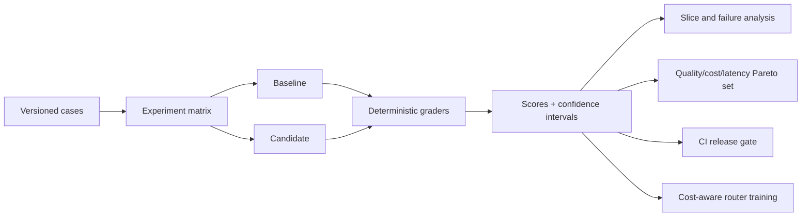

# AgentForge evaluation case study

## Problem

The original system could route and answer questions, but it could not prove whether a prompt, model, retrieval strategy, or tool policy improved behavior. AgentForge adds reproducible experiments and a release gate so changes can be evaluated before deployment.

## Reproducible baseline

The checked-in routing ablation compares a deliberately simple keyword baseline with the production hybrid router on the same 25 cases. The dataset is fingerprinted in every report.

| Variant | Quality score | Case pass rate | Routing failures |
|---|---:|---:|---:|
| Keyword baseline v1 | 87.2% | 84% | 4 |
| Production hybrid router | 100% | 100% | 0 |

These figures describe only the public routing regression set. They do not establish end-to-end answer quality or generalize to private data.

## Failure-driven improvement

The initial run identified two production-router failures:

- an uploaded-document prompt fell through to an unnecessary model classifier;
- a short unresolved-reference prompt was not classified as needing clarification.

Both failures were converted into regression cases and the routing rules were corrected. This demonstrates the intended loop: observe, categorize, fix, and protect against regression.

## Evaluation architecture

## Human and model evaluation controls

- Synthetic candidates are marked `synthetic_seed` and cannot be described as human-reviewed.
- Review exports require reviewer identity, decision, timestamp, and notes before labels become `human_reviewed`.
- Pairwise LLM judges run both candidate orders to measure position bias.
- Judge accuracy is calculated only on human-reviewed preferences.
- Private holdout labels remain outside the repository.
- Adaptive-router thresholds are fitted on validation data and reported separately on the held-out test split.
- The successor router logs action propensities and is promoted only after IPS, SNIPS, doubly robust, effective-sample-size, confidence, and safety gates pass on held-out feedback.
- Adaptive best-of-N generation can use a learned process verifier rather than trusting self-reported confidence; step rewards, early pruning, counterfactual credit, receipt integrity, success lift, and unsafe-selection rate are gated separately.

## Coding-agent reliability controls

The sandbox coding subsystem is evaluated as both an AI loop and an execution system. Its deterministic benchmark records pass@1, test/regression outcomes, sandbox violations, cost, latency, and replayable tool trajectories. Its durable control-plane tests separately prove:

- concurrent claims are exclusive;
- duplicate submissions are idempotent per user;
- expired worker leases are recovered after interruption;
- transient errors back off and exhausted retries dead-letter;
- job state and approval survive manager restart;
- rejected artifacts are erased; and
- approved artifacts fail closed when their digest no longer matches.

The verified PR workflow adds a second evidence layer: typed repository analysis, a test-author role confined to test paths, independent review, deterministic security and quality gates, and bounded repair. Credential-free tests prove that unsafe additions trigger repair, critical/high findings override a contradictory model approval, role-confined writes are rejected, source-repository mutation is detected, and blocked jobs retain a diagnostic dossier without retaining the patch body.

This separation matters: model-quality scores cannot establish that a long-running agent is operationally safe, and reliable queue behavior cannot establish that its patches are correct. Both evidence layers are required.

The optional [repair tournament](multi-agent-repair-tournament.md) adds isolated specialist teams and a common [pre-patch regression designer](regression-challenge-agent.md). The designer emits bounded JSON behavior probes against operator-selected functions before seeing any patch. Baseline discrimination and repeated candidate executions provide an additional veto; exact expectations remain reviewable because generated oracles can be wrong. The authored weak-patch ablation and failure controls demonstrate the engineering contract, not an unmeasured live-model resolution gain.

The optional [reference-calibration stage](oracle-calibration.md) tests that evaluator before any repair team starts. A private, source-pinned reference checks expectation agreement; deterministic AST faults measure bounded mutation sensitivity. The controller records a probe-to-fault kill matrix without releasing reference code to models or candidate workspaces. Reference revocation, unstable runs, weak sensitivity, or cleanup failures withhold the patch. The new runtime/control suite passed 27 tests with one Docker skip on Python 3.11 and 3.13, with 95.7% focused statement/branch coverage. The broader affected run passed 238 tests with five platform/Docker skips. Real Docker controls and live-model oracle quality remain unverified locally; the feature is off by default.

## Code-context retrieval evidence

The verified PR agent now performs a separate code-intelligence step before analysis and implementation. Six-language Tree-sitter metadata, decomposed query facets, BM25 relevance, semantic embeddings, dependency propagation, and optional cross-encoder reranking produce a compressed token-bounded context pack. Each selection records backend identities, ranks, score components, reasons, file/snippet digests, compression statistics, and an overall fingerprint in the final dossier.

The original five-case source-only regression study measured Recall@8 `1.00`, MRR `1.00`, and NDCG@8 `0.9433` for the hybrid reranked baseline. Its 20-point strategy/token-budget ablation retained Recall@8 `1.00` at 512 tokens for all strategies, while lexical-plus-graph had the best NDCG@8 (`0.9754`). At that budget, hybrid-reranked packs used about 479 tokens, reduced their selected raw windows by 25.8%, and removed 5.4 duplicate lines per query. This historical result is retained even though the simpler method won. The first V1 experimental run was rejected because the relevance-label dataset itself entered the index. The current harness additionally uses tracked source/configuration and normalized offline line endings, excluding private local repositories and local-only files. After the latest source refresh, the learned fusion candidate matches the fixed baseline (NDCG `0.9594`, recall/MRR `1.00`) on the five-query regression set. Its non-regression gate accepts it for review, but there is no measured gain and serving remains on the fixed baseline. The earlier `0.9295` regression belongs to the preceding source snapshot. See [code intelligence](code-intelligence.md) for the current protocol. These small repository-specific checks are not general retrieval-performance evidence.

## Agent security evidence

The security regression corpus contains 19 attacks and eight benign controls across user, repository, retrieval, tool-output, memory, and peer-agent boundaries. The deliberately permissive policy baseline has 100% attack success. The deterministic complete-mediation policy contains all 19 checked-in attacks while allowing all eight benign actions, with zero measured secret leakage and unsafe tool calls. These figures describe a narrow, policy-aligned deterministic corpus, not universal robustness or an external certification. The value of the lab is that future policy changes now have measurable attack-success and benign-utility regression gates.

## Coding benchmark release controls

The benchmark release layer freezes exact case IDs and content fingerprints before matrix execution. It compares model, workflow, and retrieval variants only when their reports share both the dataset fingerprint and exact case set. Candidate deltas use paired bootstrap intervals and exact McNemar tests; selection also exposes the Pass@1/cost/P95-latency Pareto set. Release JSON, a Markdown benchmark card, and their integrity manifest are emitted together.

The checked-in four-variant smoke matrix is validation evidence for the pipeline only. It is not presented as a model-performance result because Docker/provider execution was not available for this iteration. Generated cards state whether evidence came from the local harness and explicitly reject official SWE-bench leaderboard wording until predictions are evaluated by the official harness.

## Privacy-safe GenAI observability

Both public research-agent paths and sandboxed coding workflows now emit a shared, versioned trace model using OpenTelemetry GenAI attribute names. Traces connect agent and model operations to graph nodes, coding tools, security-policy decisions, tokens, estimated cost, latency, route, and outcome. Prompt, response, retrieval, tool-output, and source-code content are excluded; repository and file identities are hashed.

The same traces are evaluation data. A command-line gate checks trace structure, semantic-attribute coverage, content-bearing keys, and secret-like values, while reporting error rate and latency/cost totals. Unit tests also export the internal representation through a real OpenTelemetry SDK processor and verify the parent-child hierarchy. This creates evidence for operability and privacy without claiming that local telemetry is an external production SLO.

## Reliability and fault-injection evidence

A versioned reliability corpus now drives model, retrieval, tool, persistence, worker, context, stream, and policy failures through an executable recovery state machine. The one-attempt baseline passes three healthy controls (`20%` overall), while the resilient configuration satisfies all 15 declared outcomes and SLOs. Ten recoverable faults recover, two permanent or unsafe failures are contained, and three healthy controls add no retry overhead. Simulated resilient P95 is `157.1 ms` and the policy adds `$0.00695` across the corpus.

These values prove deterministic retry, fallback, repair, resume, lease-recovery, compression, and fail-closed control paths. They are explicitly not production availability or load-test results. Dataset, policy, event, and report fingerprints make regressions and modified evidence detectable. A read-only AgentOps command center presents the reliability comparison alongside OpenTelemetry traces, security attacks, retrieval results, and benchmark releases.

## Stateful behavioral-arena evidence

The behavioral arena adds multi-turn evaluation with conditional adversary branches. It grades action, routing, required outcomes, exact tool use, forbidden-output safety, and cross-turn memory; a three-member deterministic judge ensemble exposes disagreement. Per-scenario pairwise matches update Elo standings, while a release decision requires a quality improvement, an absolute candidate pass threshold, bounded cost and P95-latency ratios, and no safety regressions. Dataset, trajectory, promotion, and whole-report fingerprints support tamper detection and replay receipts.

On the checked-in ten-case synthetic corpus, the deliberately naïve policy passes 30% of scenarios with a 0.7139 mean quality score and three safety failures. The resilient deterministic policy passes all scenarios with a 1.0000 quality score, exact tool trajectories, zero safety failures, a +0.2861 quality delta, and a lower simulated P95 (38 ms versus 57 ms). The promotion gate approves it and the pairwise tournament ranks it first. These numbers validate the evaluation and policy-control machinery only; they are not live-model, human-reviewed, or production performance. A live LangGraph adapter and optional structured LLM judge are implemented for the next measured study.

## LLM inference control-plane evidence

An opt-in gateway now wraps real LangGraph model calls with provider-neutral adapters, prompt admission, per-tenant spend budgets, provider timeouts, circuit breakers, half-open probes, budget-aware fallback, tenant/system-scoped similarity caching, deterministic canaries, and shadow evaluation. High-risk requests bypass caches and experiments. Every decision produces an integrity-bound receipt containing content fingerprints and operational metadata without prompt or response text.

The 12-case credential-free control suite passes all scenarios with 100% receipt integrity and zero measured content leakage. It recovers every scripted primary-provider and circuit failure, proves tenant cache isolation and shadow non-interference, and assigns 19.9% of 2,000 stable request IDs to a 20% canary target. This validates deterministic control flow only. It does not establish real provider availability, model quality, cost reduction, cache precision, or distributed-budget correctness.

## Online AI governance evidence

The inference gateway now emits strict content-free operational events into an online evaluation controller. Delivery is idempotent, conflicting event IDs fail closed, delayed human or calibrated-grader labels are joined only when tenant fingerprints match, and enriched events are resealed. Rolling windows track quality, safety, P95 latency, cost, success, caching, and fallback behavior. Multi-window error-budget burn and Jensen-Shannon provider-mix drift feed a canary decision that uses a 95% quality-delta confidence interval plus explicit safety, latency, cost, and minimum-sample constraints.

The checked-in incident stream accepts 20 unique events, suppresses one duplicate, joins two delayed labels, verifies 100% event integrity, and records zero prohibited content fields. It detects a control-to-canary quality change from `0.901` to `0.595`; the 95% quality-delta interval is approximately `[-0.328, -0.284]`. It also observes a `5.23x` P95 latency ratio and `3.06x` average cost ratio, raises six multi-window alerts, and returns `rollback`. This is deterministic incident-response evidence, not production traffic or model-quality evidence.

## Trustworthy long-term memory evidence

The research graph now has separate memory-read and memory-write stages. The write stage stores only
explicit, structured user requests as episodic, semantic, preference, or procedural records. The read
stage ranks tenant-scoped active records by hashed semantic similarity, lexical overlap, recency,
confidence, trust, importance, and observed usefulness, then supplies a bounded prompt block marked as
untrusted data. Conflicting facts retain version lineage; helpful episodes can be consolidated into
semantic knowledge; correction, export, tombstone deletion, and forget-all operations are authenticated.

The checked-in 12-scenario governance suite passes all controls with zero measured cross-tenant
leakage, poisoning success, stale retrieval, deletion violations, and token-budget violations. It also
checks PII redaction, explicit-consent extraction, conflict replacement, and artifact tamper detection.
These are deterministic synthetic control tests over a SQLite and hashed-vector reference backend—not
evidence of production privacy, learned-retrieval quality, or conversational memory accuracy.

## Claim-grounding and hallucination-control evidence

An optional release gate now sits after answer synthesis. It withholds draft tokens, separates the
answer into factual claims, aligns each claim with route-scoped web/RAG/knowledge-graph/calculator
evidence, and validates every Markdown URL against the retrieved-source allowlist. Numerical and
other high-risk assertions require stronger support. The policy either releases the answer, retains
only supported claims, or returns an evidence-insufficiency abstention. Every decision carries an
integrity-bound report with claim coverage, citation precision, confidence, and evidence fingerprints.

The checked-in 12-case suite passes all declared outcomes with zero unsafe-answer releases, zero
fabricated-citation escapes, zero unsupported high-risk claim escapes, complete bounded-repair
success, and complete receipt integrity. These numbers validate deterministic policy mechanics over
synthetic text. They are not an estimate of real-world hallucination prevalence or an NLI benchmark;
those claims require independently annotated claim/evidence pairs and repeated live-model runs.

## Conformal uncertainty and selective-generation evidence

Grounding confidence now feeds an optional split-conformal controller. A versioned calibration set
produces finite-sample global and route-aware nonconformity quantiles. Runtime confidence is converted
into a correctness prediction set, and the system releases an answer only when that set is exactly
`{correct}`. Ambiguous sets, missing/tampered calibration artifacts, and verifier failures abstain.
The artifact and each decision carry integrity fingerprints; confidence histograms support
Jensen–Shannon drift detection.

On the checked-in synthetic split, 25 examples fit five route-specific thresholds and 15 disjoint
examples evaluate them. The gate releases two thirds of test answers with 100% selective accuracy,
zero empirical error among released answers, and 100% abstention on incorrect examples; the scripted
distribution-shift drill is detected. These figures demonstrate the mechanics only. Conformal
coverage requires exchangeability, and this synthetic dataset is not representative production
evidence or a statistical guarantee.

## Adaptive test-time compute evidence

The runtime now treats inference depth as a policy decision. Grounding confidence, conformal
correctness sets, out-of-distribution flags, evidence availability, and high-risk claims select an
early exit, bounded independent candidate generation, or immediate abstention. Candidate calls have
provider-side completion caps and a cumulative latency ceiling. Every candidate is grounded again,
optionally conformal-filtered, and compared through its independently selected evidence IDs. Only a
consensus candidate can be released; hidden drafts and reasoning text never enter receipts or client
streams.

On the checked-in 13-scenario deterministic ablation, the deliberately fixed one-shot baseline has
50% selective accuracy. The adaptive policy has 100% selective accuracy on released outcomes,
recovers all three scripted recoverable failures, records zero unsafe releases and budget violations,
and uses 59.0% fewer candidate calls than an always-deliberate three-candidate policy. All scenario
gates and integrity checks pass. These figures validate allocation, stopping, and evidence-consensus
mechanics over simulated candidate outcomes; they do not establish live-model quality, cost savings,
or latency improvements.

The next layer turns the learned process verifier into a reasoning-time search value function. A
bounded MCTS controller explores typed retrieve, reason, verify, answer, and abstain actions while
enforcing evidence, risk, token, depth, node, and iteration constraints. Runtime plans operate over
the evidence already in the research graph; each selected path is attached to adaptive compute with
policy, request, model, and plan fingerprints.

On a separate checked-in ten-scenario synthetic holdout, a fixed confidence policy succeeds on 30%
of scenarios and releases unsafe answers on 30%. Verifier-guided search succeeds on all scenarios,
recovers all authored recoverable cases, records zero unsafe releases and budget violations, and
verifies every plan receipt. CI reproduces the exact report. This demonstrates deterministic search
and safety mechanics, not general reasoning improvement; live-model transitions and human-reviewed
private traces remain necessary before making that claim.

The planner can also run against a five-member bootstrapped process-reward ensemble. Validation
temperature-scales its mean score, while member disagreement estimates epistemic uncertainty. MCTS
optimizes a risk-adjusted lower confidence bound and abstains when the verifier itself is out of
distribution. Uncertain plans enter a deduplicated SQLite review queue containing fingerprints and
typed metadata, never prompts, answers, retrieved content, or hidden reasoning.

In a ten-scenario synthetic corruption drill, a behaviorally inverted single verifier selects an
unsafe trajectory in every shifted case. The ensemble preserves all five clean selections, detects
and contains all five shifts with zero unsafe selections, and queues every shifted case for review.
This is a narrow control-plane test, not evidence that five small models cover real production drift.

The latest layer also learns the planner's action dynamics instead of assuming that retrieval,
reasoning, and verification always produce fixed confidence gains. A three-member bootstrapped world
model predicts next-state confidence, evidence change, and transition success from route, risk,
action, and current planning state. MCTS rolls forward with conservative lower bounds; unsupported
routes or excessive member disagreement remove answer branches and lead to abstention. Artifacts and
plan receipts carry fingerprints so a changed dynamics model is visible and tampering fails closed.

On a ten-transition synthetic holdout, confidence-delta MAE falls from `0.01000` for the fixed rules
to `0.00574` for learned dynamics, while transition-success Brier score falls from `0.10000` to
`0.02867`. All unseen-route and injected member-shift probes are detected, the supported planning
scenario completes, and both shifted scenarios abstain. The 42.6% and 71.3% improvements are narrow offline ablations over
authored data; they establish the training, uncertainty, promotion, and fallback pipeline, not a
claim that the model represents arbitrary real environments.

The planner now has a third learned component: a Conservative Q-Learning policy trained entirely
from logged typed-action trajectories. A bootstrapped Q ensemble produces risk-adjusted action
priors for PUCT, while the existing planner still owns evidence, verification, safety, and compute
constraints. Unknown routes and high ensemble disagreement fall back to uniform priors rather than
turning an uncertain acceleration policy into an availability dependency.

The promotion gate uses sequential off-policy evaluation instead of replaying only the actions the
candidate already prefers. It accumulates per-decision importance ratios and reports IPS, SNIPS, a
doubly robust return, effective sample size, and a whole-episode bootstrap interval. On the authored
eight-episode holdout, mean behavior return is `0.2825`; estimated target return is `0.8071` with a
95% interval of `[0.6183, 1.0186]`, effective sample size `4.39`, positive-action accuracy `100%`,
zero behavior-support violations, and zero actions outside the safety mask. These are deterministic integration results with synthetic
propensities, not evidence of real-traffic policy improvement.

Search policy distillation adds a smaller prior model trained from the planner's own visit counts.
Training and validation states are generated independently of the frozen ten-case test suite.
Validation KL drops from `0.1809` for uniform priors to `0.0142`. Both uniform and distilled search
solve every scenario at 8, 16, 32 and 96 iterations. At 32 iterations the distilled policy reduces
distinct reward evaluations from 4.2 to 3.6 per case and expanded nodes from 7.0 to 6.2, with no
safety or token-budget failures. At eight iterations the baseline already matches teacher quality,
so this study records no iteration-budget advantage. The compute curve makes this limitation
visible instead of turning a narrow score-evaluation reduction into a latency or live-model claim.

## Evidence-intelligence and conflict-control evidence

An optional 18th graph node now evaluates retrieved material before answer generation. It quarantines
prompt-injection patterns, collapses near-identical content even when copied across different domains,
selects a representative by operator-defined authority and freshness signals, enforces independent
sources, checks requested recency windows, and builds explicit numeric and negation conflict edges.
Only the resulting evidence objects can reach synthesis, automatic citation completion, grounding,
conformal control, or adaptive deliberation.

The checked-in 14-scenario suite preserves all six benign web, hybrid, local, graph, and calculator
cases while containing every authored injection, duplicate-laundering, contradiction, stale/undated,
and single-source case. It records 100% injection quarantine, duplicate blocking, conflict detection,
stale-evidence blocking, and receipt integrity with zero unsafe evidence releases. These figures
validate deterministic controls over a narrow authored corpus. The heuristic detector is not a
general NLI model, and the authority list is operator policy rather than an objective trust ranking.

## Next measured study

The repository includes 120 candidate cases across routing, safety, grounded answerability, citations, graph reasoning, and math. Before publishing broader claims:

1. have a human reviewer approve or correct the candidate labels;
2. add authorized retrieval relevance labels for the project documents;
3. configure two real model variants and current provider prices;
4. run the live experiment on train, validation, and private test splits;
5. calibrate the pairwise judge against at least 20 reviewed comparisons;
6. publish held-out quality, cost reduction, confidence intervals, and failure slices here.
7. freeze and run a 25–50 case SWE-bench Multilingual matrix, then attach the official evaluator output to the public benchmark release.

Blank or placeholder metrics are deliberately not presented as results.
