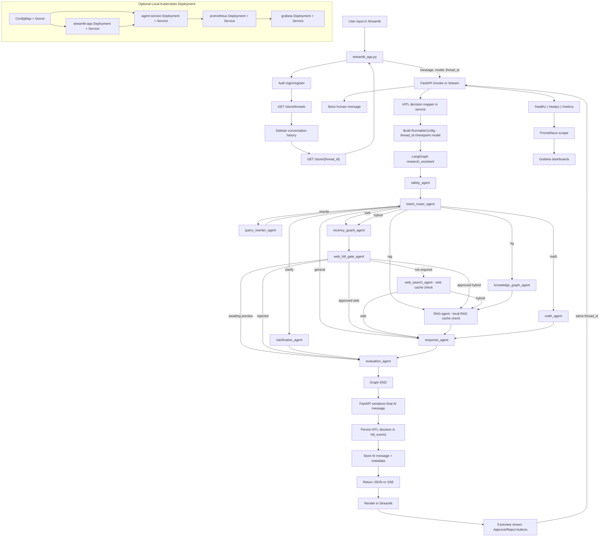

# Agent Runtime Flow

## File Purpose

- Human-readable architecture explanation for the runtime execution flow.
- Best for onboarding and quick understanding of how requests move across agents.

This flowchart matches the current codebase behavior (`agent/research_assistant.py`, `service/service.py`, `streamlit_app.py`).

## Notes

- `clarification_agent` does not continue to `response_agent` in the same run.
- Clarified user reply comes as a new turn and is routed again by `intent_router_agent`.
- On login, UI calls `GET /store/threads`, auto-loads latest thread, and can switch older thread history.
- For recency/news prompts, graph-level HITL runs in `web_hitl_gate_agent`.
- The assistant returns preview context; Streamlit shows `Approve`/`Reject` buttons (typing `approve` or `reject: <reason>` also works).
- Service rewrites plain approve/reject input into internal HITL control payload using pending context for the same `user_id` + `thread_id`.
- HITL decisions are audited automatically and persisted in `hitl_events`.
- `local:` prefix routes to `rag` or `kg` depending on relationship intent.
- `knowledge_graph_agent` reads from dedicated Graph RAG ingestion (`graph_rag_docs` -> `graph_chroma_db`).
- `rag_agent` reads from local RAG ingestion (`rag_docs` -> `chroma_db`).
- Web/RAG/Graph-RAG cache checks happen inside retrieval internals (Redis or in-memory fallback).
- UI can show source-path footer metadata (for example: `Sources: web via mcp` or cache backend labels).
- Prometheus scrapes `/metrics`; Grafana visualizes Prometheus data.
- Kubernetes manifests for this flow are available in `k8s/`.
