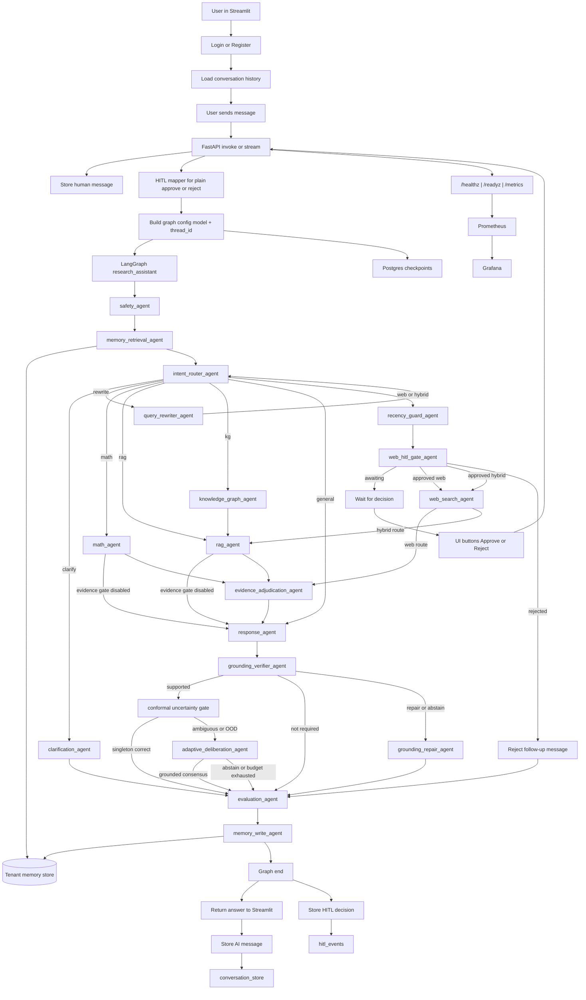

# Agent Runtime Flow

## File Purpose

- Human-readable architecture explanation for the runtime execution flow.
- Best for onboarding and quick understanding of how requests move across agents.

This flowchart matches the current codebase behavior (`agent/research_assistant.py`, `service/service.py`, `streamlit_app.py`).

```mermaid
flowchart TD
    U[User in Streamlit] --> AUTH[Login or Register]
    AUTH --> HIST[Load conversation history]
    HIST --> Q[User sends message]
    Q --> API[FastAPI invoke or stream]

    API --> STOREH[Store human message]
    API --> HMAP[HITL mapper for plain approve or reject]
    HMAP --> CFG[Build graph config model + thread_id]
    CFG --> LG[LangGraph research_assistant]
    CFG --> CHK[Postgres checkpoints]

    LG --> SA[safety_agent]
    SA --> MR[memory_retrieval_agent]
    MR --> MEM[(Tenant memory store)]
    MR --> IR[intent_router_agent]

    IR -->|clarify| CA[clarification_agent]
    CA --> EVA[evaluation_agent]

    IR -->|rewrite| QR[query_rewriter_agent]
    QR --> IR

    IR -->|math| MA[math_agent]
    MA -->|evidence gate disabled| RESP[response_agent]

    IR -->|rag| RA[rag_agent]
    RA -->|evidence gate disabled| RESP

    IR -->|kg| KG[knowledge_graph_agent]
    KG --> RA

    IR -->|general| RESP

    IR -->|web or hybrid| RG[recency_guard_agent]
    RG --> WH[web_hitl_gate_agent]

    WH -->|awaiting| WAIT[Wait for decision]
    WAIT --> BTN[UI buttons Approve or Reject]
    BTN --> API

    WH -->|approved web| WS[web_search_agent]
    WS -->|web route| EQ[evidence_adjudication_agent]

    WH -->|approved hybrid| WS
    WS -->|hybrid route| RA

    WH -->|rejected| REJ[Reject follow-up message]
    REJ --> EVA

    RA --> EQ
    MA --> EQ
    EQ --> RESP
    RESP --> GV[grounding_verifier_agent]
    GV -->|supported| UC[conformal uncertainty gate]
    UC -->|singleton correct| EVA
    UC -->|ambiguous or OOD| AD[adaptive_deliberation_agent]
    AD -->|grounded consensus| EVA
    AD -->|abstain or budget exhausted| EVA
    GV -->|not required| EVA
    GV -->|repair or abstain| GR[grounding_repair_agent]
    GR --> EVA
    EVA --> MW[memory_write_agent]
    MW --> MEM
    MW --> END[Graph end]
    END --> APIRESP[Return answer to Streamlit]
    APIRESP --> STOREA[Store AI message]
    STOREA --> CST[conversation_store]
    END --> HITLDB[Store HITL decision]
    HITLDB --> HITL[hitl_events]

    API --> METRICS["/healthz | /readyz | /metrics"]
    METRICS --> PROM[Prometheus]
    PROM --> GRAF[Grafana]
```

## Notes

- `clarification_agent` does not continue to `response_agent` in the same run.
- Memory is opt-in. The read node always remains in the graph but returns empty state while disabled;
  the write node persists only explicit memory requests after evaluation.
- Retrieved memory is token-bounded, tenant-scoped, and marked as untrusted data before synthesis.
- Evidence quality is opt-in. When enabled, retrieved evidence passes through injection quarantine,
  cross-domain duplicate collapse, independent-source and freshness checks, and a numeric/negation
  conflict graph. Only the adjudicated evidence objects can reach synthesis and later release gates.
- Grounding verification is opt-in. When enabled, draft tokens are withheld until claims and citation
  URLs have been checked against the route-scoped evidence; the graph then releases the draft,
  repairs supported portions, or abstains.
- Conformal uncertainty control is separately opt-in and hot-loads a signed calibration artifact. It
  releases only singleton-correct prediction sets and fails closed when calibration is unavailable.
- Adaptive test-time compute is separately opt-in. It early-exits verified answers, sends uncertain
  but recoverable answers through bounded private candidate generation, and requires grounded
  evidence consensus before release. High-risk unsupported or evidence-free requests still abstain.
- Clarified user reply comes as a new turn and is routed again by `intent_router_agent`.
- On login, UI calls `GET /store/threads`, auto-loads latest thread, and can switch older thread history.
- For recency/news prompts, graph-level HITL runs in `web_hitl_gate_agent`.
- Streamlit shows `Approve`/`Reject` buttons for waiting HITL decisions (typing `approve` or `reject: <reason>` also works).
- Service only maps plain approve/reject input to `Command(resume=...)` when the same user/thread checkpoint contains an active native interrupt; process memory is only a fast-path cache.
- HITL decisions are audited automatically and persisted in `hitl_events`.
- `local:` prefix routes to `rag` or `kg` depending on relationship intent.
- `knowledge_graph_agent` reads from dedicated Graph RAG ingestion (`graph_rag_docs` -> `graph_chroma_db`).
- `rag_agent` reads from local RAG ingestion (`rag_docs` -> `chroma_db`).
- Web/RAG/Graph-RAG cache checks happen inside retrieval internals (Redis or in-memory fallback).
- Source and trace metadata are stored for observability without appending internal execution footers to user answers.
- Prometheus scrapes `/metrics`; Grafana visualizes Prometheus data.
- Kubernetes manifests for this flow are available in `k8s/`.
