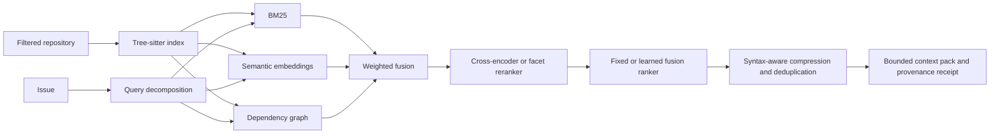

# Code Intelligence V2

The verified PR workflow uses a bounded retrieval pipeline before its analyst and implementer stages. It narrows a repository into evidence-bearing code snippets instead of placing an arbitrary file listing or the full repository in a model prompt.

## Pipeline



Repository code is parsed as data and is never imported or executed during indexing.

## Six-language parsing

`CodeParser` uses Tree-sitter for Python, TypeScript, JavaScript, Java, Go, and Rust. It extracts named declarations, imports, calls, and syntax spans used for focused snippets. Python AST and bounded language patterns are retained as fail-safe fallbacks for environments without Tree-sitter.

`CodeIntelligenceIndex.build(previous=...)` handles two incremental cases:

- unchanged files reuse their complete indexed documents and embeddings by SHA-256;
- changed files edit a copy of the previous Tree-sitter tree and pass it to the next parse, allowing unchanged subtrees to be reused.

The receipt states how many files were parsed, reused, and incrementally reparsed and counts each parser backend. Raw parse trees and source embeddings remain process-local.

## Query planning and hybrid retrieval

The issue is decomposed into independently auditable facets:

- lexical concepts;
- explicit paths and filenames;
- CamelCase, snake_case, and quoted symbols;
- test and regression intent; and
- import, caller, and dependency intent.

Four strategies are available for controlled ablations:

| Strategy | Signals |
|---|---|
| `lexical` | BM25, path, symbol, and test-intent boosts |
| `lexical_graph` | Lexical signals plus dependency propagation |
| `hybrid` | Lexical, graph, and semantic embedding similarity |
| `hybrid_rerank` | Hybrid candidate generation plus reranking |

The credential-free default uses a deterministic 384-dimensional feature-hashing embedding with limited code-domain concept expansion and an auditable query-facet reranker. These are stable offline baselines, not claims of learned semantic understanding.

The verified PR workflow defaults to `hybrid_rerank`, eight selected files, and a 4,096-token context ceiling. Operators can change these with `CODE_CONTEXT_STRATEGY`, `CODE_CONTEXT_TOP_K`, and `CODE_CONTEXT_MAX_TOKENS`; the chosen values remain visible in each receipt.

Install `requirements-code-intelligence-ml.txt` and select these production adapters for learned retrieval:

```bash
CODE_CONTEXT_EMBEDDING_BACKEND=sentence-transformers
CODE_CONTEXT_EMBEDDING_MODEL=sentence-transformers/all-MiniLM-L6-v2
CODE_CONTEXT_RERANKER_BACKEND=cross-encoder
CODE_CONTEXT_RERANKER_MODEL=cross-encoder/ms-marco-MiniLM-L-6-v2
```

The adapters use Sentence Transformers' asymmetric query/document APIs and a cross-encoder over only the fused candidate pool. Model loading is explicit; missing packages or model failures produce a recorded fallback rather than silently breaking the coding workflow.

## Hard-negative learning and neural fine-tuning

The retrieval signals can now be trained instead of relying only on hand-selected weights. The learning workflow retrieves a bounded candidate pool for each labelled query, keeps relevant paths as positives, and selects the highest-ranked irrelevant paths as hard negatives. Persisted mining reports contain paths, hashes, ranks, and numeric features—never repository source.

Train the deterministic pairwise logistic fusion model:

```bash
python -m code_agent.retrieval_learning train-fusion \
  evals/datasets/code_context_learning.jsonl \
  --repository-root . \
  --negatives-per-positive 4 \
  --epochs 400 \
  --output evals/experiments/code_context_fusion.json
```

Validate it on the separate regression holdout and reject metric regressions:

```bash
python -m code_agent.retrieval_learning validate-fusion \
  evals/datasets/code_context_smoke.jsonl \
  --repository-root . \
  --artifact evals/experiments/code_context_fusion.json \
  --require-promotion \
  --output data/evaluations/code-context/fusion.json
```

Activate an approved artifact with `CODE_CONTEXT_FUSION_ARTIFACT`. The runtime verifies its SHA-256 fingerprint and exact feature schema before use; a malformed or tampered artifact falls back to the fixed-weight ranker and records the reason in the context receipt.

With `requirements-code-intelligence-ml.txt` installed, the same hard negatives can fine-tune a bi-encoder using triplet loss or a cross-encoder using positive/negative relevance pairs:

```bash
python -m code_agent.retrieval_learning fine-tune \
  --kind bi-encoder \
  --model sentence-transformers/all-MiniLM-L6-v2 \
  --output-dir data/models/code-bi-encoder
```

Every neural run writes an `agentforge_training_manifest.json` tying the output to its base model, dataset fingerprint, index fingerprint, pair count, epochs, and batch size.

The checked-in deterministic fusion artifact was trained from 44 hard-negative pairs and reached 93.18% pairwise training accuracy. On the separate five-query holdout it preserved Recall@8 `1.00`, MRR `1.00`, and NDCG@8 `0.9433`. It did not improve that already-saturated small holdout, so the evidence is reported as a non-regression result rather than a quality-gain claim.

CI retrains the fusion model and checks byte-for-byte reproducibility with `--check`, then runs the holdout promotion gate. A dataset, source-index, feature, hyperparameter, or weight change therefore requires an explicit artifact review.

## Compression, budgets, and provenance

The context builder prefers complete matching syntax spans, adds small line windows around other matches, collapses repeated blanks, and removes duplicate substantive lines across selected files. It then enforces a hard approximate token budget. Every included file has a snippet hash so the persisted receipt binds the exact compressed evidence without storing raw source.

Receipts include:

- the decomposed query plan and selected retrieval strategy;
- lexical, graph, semantic, and reranker scores;
- parser, embedding, and reranker backend identities;
- file and snippet hashes, rank, language, reasons, and token estimate;
- original/final context size and deduplicated-line count;
- parsed/reused/incremental file counts; and
- a fingerprint over the query plan, strategy, ranks, files, and snippets.

## Evaluation and ablations

Run the leakage-resistant source-only quality gate:

```bash
python -m code_agent.context_evaluation \
  --repository-root . \
  --top-k 8 \
  --min-recall 0.90
```

Generate a complete strategy and token-budget experiment:

```bash
python -m code_agent.context_evaluation \
  --repository-root . \
  --top-k 8 \
  --ablation \
  --token-budgets 256,512,1024,2048,4096 \
  --output data/evaluations/code-context/latest.json

streamlit run code_agent/context_dashboard.py
```

The dashboard plots Recall@K, MRR, NDCG@K, actual token use, selected files, compression, and deduplicated lines for every strategy/budget pair. The evaluation corpus excludes its labels, tests, documentation, generated package metadata, runtime data, infrastructure, and root prose.

The current five-case repository regression set measures Recall@8 `1.00`, MRR `1.00`, and NDCG@8 `0.9433` for `hybrid_rerank`. At a 512-token budget all four strategies retain Recall@8 `1.00`; `lexical_graph` has the best NDCG@8 (`0.9754`) on this small set. The 512-token hybrid-reranked packs use about 479 tokens on average, are 25.8% smaller than their pre-compression selected windows, and remove 5.4 duplicate lines per query. This negative result for extra model complexity is retained deliberately: it demonstrates ablation discipline rather than assuming semantic or reranking components always help.

These figures are repository-specific regression evidence, not general code-retrieval performance. A credible external claim requires human relevance labels from additional private repositories and downstream patch-quality experiments.

## Security and operating limits

- Indexing reads through the secret-filtered, symlink-rejecting workspace boundary.
- Tree-sitter parsing does not execute build scripts or imports.
- Source, trees, and embeddings are memory-only; persisted receipts contain hashes and metadata.
- Context is explicitly labeled untrusted in every model prompt.
- Tree-sitter extraction is bounded by repository/file limits and a maximum visited-node count.
- Learned local models require deliberate installation and can add memory, latency, and model supply-chain risk.
