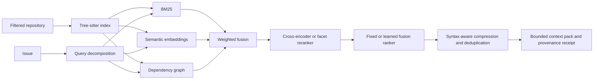

# Code Intelligence V2

The verified PR workflow uses a bounded retrieval pipeline before its analyst and implementer stages. It narrows a repository into evidence-bearing code snippets instead of placing an arbitrary file listing or the full repository in a model prompt.

## Pipeline



Repository code is parsed as data and is never imported or executed during indexing.

## Six-language parsing

`CodeParser` uses Tree-sitter for Python, TypeScript, JavaScript, Java, Go, and Rust. It extracts named declarations, imports, calls, and syntax spans used for focused snippets. Python AST and bounded language patterns are retained as fail-safe fallbacks for environments without Tree-sitter.

`CodeIntelligenceIndex.build(previous=...)` handles two incremental cases:

- unchanged files reuse their complete indexed documents and embeddings by SHA-256;
- changed files edit a copy of the previous Tree-sitter tree and pass it to the next parse, allowing unchanged subtrees to be reused.

The receipt states how many files were parsed, reused, and incrementally reparsed and counts each parser backend. Raw parse trees and source embeddings remain process-local.

## Query planning and hybrid retrieval

The issue is decomposed into independently auditable facets:

- lexical concepts;
- explicit paths and filenames;
- CamelCase, snake_case, and quoted symbols;
- test and regression intent; and
- import, caller, and dependency intent.

Four strategies are available for controlled ablations:

| Strategy | Signals |
|---|---|
| `lexical` | BM25, path, symbol, and test-intent boosts |
| `lexical_graph` | Lexical signals plus dependency propagation |
| `hybrid` | Lexical, graph, and semantic embedding similarity |
| `hybrid_rerank` | Hybrid candidate generation plus reranking |

The credential-free default uses a deterministic 384-dimensional feature-hashing embedding with limited code-domain concept expansion and an auditable query-facet reranker. These are stable offline baselines, not claims of learned semantic understanding.

The verified PR workflow defaults to `hybrid_rerank`, eight selected files, and a 4,096-token context ceiling. Operators can change these with `CODE_CONTEXT_STRATEGY`, `CODE_CONTEXT_TOP_K`, and `CODE_CONTEXT_MAX_TOKENS`; the chosen values remain visible in each receipt.

Install `requirements-code-intelligence-ml.txt` and select these production adapters for learned retrieval:

```bash
CODE_CONTEXT_EMBEDDING_BACKEND=sentence-transformers
CODE_CONTEXT_EMBEDDING_MODEL=sentence-transformers/all-MiniLM-L6-v2
CODE_CONTEXT_RERANKER_BACKEND=cross-encoder
CODE_CONTEXT_RERANKER_MODEL=cross-encoder/ms-marco-MiniLM-L-6-v2
```

The adapters use Sentence Transformers' asymmetric query/document APIs and a cross-encoder over only the fused candidate pool. Model loading is explicit; missing packages or model failures produce a recorded fallback rather than silently breaking the coding workflow.

## Hard-negative learning and neural fine-tuning

The retrieval signals can now be trained instead of relying only on hand-selected weights. The learning workflow retrieves a bounded candidate pool for each labelled query, keeps relevant paths as positives, and selects the highest-ranked irrelevant paths as hard negatives. Persisted mining reports contain paths, hashes, ranks, and numeric features—never repository source.

Train the deterministic pairwise logistic fusion model:

```bash
python -m code_agent.retrieval_learning train-fusion \
  evals/datasets/code_context_learning.jsonl \
  --repository-root . \
  --negatives-per-positive 4 \
  --epochs 400 \
  --output evals/experiments/code_context_fusion.json
```

Validate it on the separate regression holdout and reject metric regressions:

```bash
python -m code_agent.retrieval_learning validate-fusion \
  evals/datasets/code_context_smoke.jsonl \
  --repository-root . \
  --artifact evals/experiments/code_context_fusion.json \
  --require-promotion \
  --output data/evaluations/code-context/fusion.json
```

Activate an approved artifact with `CODE_CONTEXT_FUSION_ARTIFACT`. The runtime verifies its SHA-256 fingerprint and exact feature schema before use; a malformed or tampered artifact falls back to the fixed-weight ranker and records the reason in the context receipt.

With `requirements-code-intelligence-ml.txt` installed, the same hard negatives can fine-tune a bi-encoder using triplet loss or a cross-encoder using positive/negative relevance pairs:

```bash
python -m code_agent.retrieval_learning fine-tune \
  --kind bi-encoder \
  --model sentence-transformers/all-MiniLM-L6-v2 \
  --output-dir data/models/code-bi-encoder
```

Every neural run writes an `agentforge_training_manifest.json` tying the output to its base model, dataset fingerprint, index fingerprint, pair count, epochs, and batch size.

The refreshed deterministic fusion artifact uses 44 hard-negative pairs and has 88.64% pairwise training accuracy. On the current five-query regression set, baseline and learned fusion both retain Recall@8 `1.00`, MRR `1.00`, and NDCG@8 `0.9594`. The evaluator's small non-regression gate accepts this candidate for review; equality is not evidence of improvement or authorization to activate it. The default empty `CODE_CONTEXT_FUSION_ARTIFACT` still keeps the fixed-weight baseline. A previous source-corpus snapshot regressed to `0.9295` and was held; changing code changes the deterministic training corpus, so current decisions must use the refreshed artifact and matching report.

The `--check` command compares the complete parsed artifact, including its fingerprints, rather than JSON whitespace. A dataset, source-index, feature, hyperparameter, or weight change requires retraining and explicit review. A stale-artifact error now identifies the changed fields. Embedding dot products, fusion logits, and training margins use explicit `math.fsum` rather than Python's version-dependent built-in floating-point summation; the exact check is not replaced with a tolerance or rounded weights. `validate-fusion --require-promotion` separately returns a nonzero status for a rejected model; keep that gate when deciding whether to activate one.

### Code CI and candidate promotion

The two checks answer different questions. Ordinary CI requires exact artifact reproduction, evaluates the candidate, and publishes its pass/hold decision in the GitHub job summary and `experimental-retrieval-decision` artifact. A valid quality hold is a recorded experimental result, not a code failure. The reporting step still fails for missing evidence, artifact tampering, inconsistent lineage, or a decision that contradicts the unchanged promotion rules. The normal baseline recall, security, unit-test, and other offline gates remain required.

The manual `Retrieval Candidate Promotion` workflow checks reproducibility again and runs the strict `--require-promotion` command above. Its quality step fails when the candidate is held, while retaining the decision report for inspection. It performs no deployment. This is an operator-facing gate, not a runtime authorization service: passing it still requires explicit owner review before configuring a model for serving. Do not dispatch it expecting this rejected candidate to pass, and do not interpret green code CI as model approval.

At a Git working-tree root (including a `.git` worktree file), the offline corpus uses `git ls-files`, reads tracked working-tree edits, and ignores local-only files. Failure to enumerate the tracked corpus is an error, not a fallback to private local files. Non-Git fixtures use bounded filesystem discovery. Both paths exclude tests, evaluation datasets, documentation, private `repositories/`, runtime data, infrastructure, root-level prose/files, and non-source prose inside source directories. Source extensions, runtime/build configuration, and `requirements*.txt` dependency lists remain eligible. LF normalization before parsing and hashing prevents Windows CRLF checkout differences from changing the offline artifact; runtime workspace hashes still bind their original content.

CI reporting helpers under `scripts/ci` are also excluded: evaluator logic and reporting code are not retrieval targets. Legitimate indexed-source edits still change the corpus fingerprint. Retrain only after the source fix is final, review changed weights and lineage, run the separate regression gate, and publish the actual hold/pass decision. Never remove a real regression reason or tune a metric threshold just to make CI green. Stage new intended source files before retraining; otherwise Git-based evaluation deliberately ignores them.

## Compression, budgets, and provenance

File-level retrieval scores can hide evidence loss during context packing. The separate
[evidence-span evaluator](evidence-span-retrieval.md) verifies source-hashed line ranges in the
actual compressed context, reports complete-span coverage and missing lines, and compares
strategies with paired task-family confidence intervals. It uses a fixed primary token budget,
query-variant slices, and synthetic-label holds without changing the production retriever or
the learned fusion artifact. Its fixture shows file recall `1.00` versus complete-span recall
`0.8333`—a compression gap, not evidence of a better model.

The context builder prefers complete matching syntax spans, adds small line windows around other matches, collapses repeated blanks, and removes duplicate substantive lines across selected files. It then enforces a hard approximate token budget. Every included file has a snippet hash so the persisted receipt binds the exact compressed evidence without storing raw source.

Receipts include:

- the decomposed query plan and selected retrieval strategy;
- lexical, graph, semantic, and reranker scores;
- parser, embedding, and reranker backend identities;
- file and snippet hashes, rank, language, reasons, and token estimate;
- original/final context size and deduplicated-line count;
- parsed/reused/incremental file counts; and
- a fingerprint over the query plan, strategy, ranks, files, and snippets.

## Evaluation and ablations

Run the leakage-resistant source-only quality gate:

```bash
python -m code_agent.context_evaluation \
  --repository-root . \
  --top-k 8 \
  --min-recall 0.90
```

Generate a complete strategy and token-budget experiment:

```bash
python -m code_agent.context_evaluation \
  --repository-root . \
  --top-k 8 \
  --ablation \
  --token-budgets 256,512,1024,2048,4096 \
  --output data/evaluations/code-context/latest.json

streamlit run code_agent/context_dashboard.py
```

The dashboard plots Recall@K, MRR, NDCG@K, actual token use, selected files, compression, and deduplicated lines for every strategy/budget pair. The evaluation corpus excludes its labels, tests, documentation, generated package metadata, runtime data, infrastructure, and root prose.

The original five-case source-only study measured Recall@8 `1.00`, MRR `1.00`, and NDCG@8 `0.9433` for `hybrid_rerank`. Its 512-token hybrid-reranked packs used about 479 tokens on average, were 25.8% smaller than their pre-compression windows, and removed 5.4 duplicate lines per query; `lexical_graph` had the best NDCG@8 (`0.9754`). Those are historical measurements, not immutable results for every future source revision. Rerun the ablation for the current tracked corpus and retain negative results for extra model complexity.

These figures are repository-specific regression evidence, not general code-retrieval performance. A credible external claim requires human relevance labels from additional private repositories and downstream patch-quality experiments.

## Security and operating limits

Context packing defaults to the existing `legacy` policy. The opt-in
`CODE_CONTEXT_PACKING_POLICY=balanced_v1` adds query-aware declaration/guard/exit windows,
whole-line budgeting, and audited source ranges without changing ranking. It preserves
identical lines from different files instead of erasing their provenance. See
[query-aware context packing](query-aware-context-packing.md) for the isolated synthetic
comparison and its limits; no numerical benchmark result automatically enables it.

- Indexing reads through the secret-filtered, symlink-rejecting workspace boundary.
- Tree-sitter parsing does not execute build scripts or imports.
- Source, trees, and embeddings are memory-only; persisted receipts contain hashes and metadata.
- Context is explicitly labeled untrusted in every model prompt.
- Tree-sitter extraction is bounded by repository/file limits and a maximum visited-node count.
- Learned local models require deliberate installation and can add memory, latency, and model supply-chain risk.
