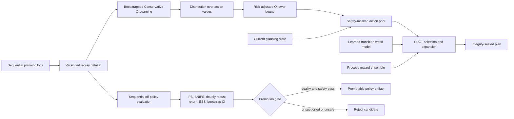

# Conservative offline-RL planning

The learned world model predicts what an action may do. It does not, by itself, learn which action
is worth trying first. AgentForge now adds a separate offline reinforcement-learning policy that
learns action values from previously logged planning trajectories and uses them as priors inside
MCTS. The policy accelerates search; the planner's evidence, safety, and budget rules remain the
authority.



## Why conservative offline RL

Naive Q-learning can assign large values to actions that rarely or never occurred in the logged
data. That is dangerous for agents: the most optimistic action may be exactly the one with the least
evidence. The trainer therefore adds a Conservative Q-Learning penalty. It increases the loss for
high-valued candidate actions and offsets that penalty only for the logged action, pushing
out-of-distribution action values downward.

Three deterministic bootstrap members learn from episode-level resamples. At inference time the
policy uses the ensemble's lower confidence bound, with a stronger uncertainty penalty for high-risk
requests. A hard action mask excludes structurally unsafe choices before probabilities are computed:
an answer cannot be proposed without enough evidence, reasoning, verification, and confidence.

The resulting probabilities feed PUCT. They affect which branch is explored first and how much
exploration pressure it receives, but they cannot bypass the planner's existing safety or token
constraints. On an unsupported route or excessive ensemble disagreement, priors become uniform and
ordinary search continues. This makes policy uncertainty a performance fallback rather than a new
availability failure.

## Sequential off-policy evaluation

Every logged transition contains an episode ID, timestep, before/after state, action, reward, safety
label, terminal flag, and behavior-policy propensity. The held-out evaluator reports trajectory IPS,
self-normalized IPS, and the per-decision doubly robust estimator. Importance ratios are accumulated
through each episode, and bootstrap confidence intervals resample whole episodes so steps from the
same trajectory are never treated as independent observations.

Promotion also requires sufficient effective sample size, no target decisions outside observed
route/state action support, at least 80% positive-action accuracy, zero target actions outside the
safety mask, a successful supported-route planning drill, artifact integrity, and uniform-prior
fallback on an unknown route.

```bash
python -m evals.offline_rl_evaluation \
  --artifact data/evaluations/offline-rl/offline-rl-policy.json \
  --output data/evaluations/offline-rl/report.json \
  --require-promotion
```

On the checked-in eight-episode synthetic holdout, the logging policy's mean discounted return is
`0.2825`. The learned target policy's doubly robust estimate is `0.8071`, with a whole-episode
bootstrap 95% interval of `[0.6183, 1.0186]`. Effective sample size is `4.39`, held-out positive-action
accuracy is `100%`, behavior-support violations and unsafe target actions are both zero. Supported PUCT planning succeeds and
the unknown-route drill falls back to uniform priors.

These numbers validate the CQL, propensity accounting, sequential OPE, promotion, and runtime
integration. They are not a claim of real-traffic policy lift: the dataset is small and authored,
its propensities are synthetic, and the confidence interval has only eight episode clusters. A
production decision needs privacy-reviewed logs from the deployed behavior policy, minimum support
per route and risk slice, time-separated evaluation, reward audits, and online canary monitoring.

## Enable it

Train the artifact first, then enable it alongside verifier-guided MCTS:

```dotenv
VERIFIER_MCTS_ENABLED=true
OFFLINE_RL_POLICY_ENABLED=true
OFFLINE_RL_POLICY_PATH=data/evaluations/offline-rl/offline-rl-policy.json
```

The learned world model and offline-RL policy can be enabled together. The world model supplies
conservative next-state predictions, the offline policy supplies action priors, and the process
reward model still evaluates completed trajectories.
