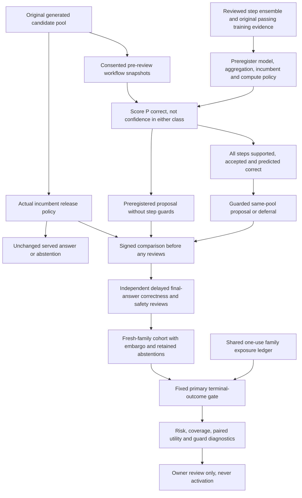

# From step uncertainty to answer outcomes

A reviewed step ensemble can predict workflow annotations well and still rank a bad final answer
above a good one. We now test that gap directly, without letting an experimental model serve an
answer. This upgrade combines a conservative step-to-answer adapter, prospective final-outcome
shadows, and an independently recorded no-step-guard ablation.

It reuses the signed replay and workflow snapshots. No new LLM call is made, no active model file
is replaced, and the incumbent selector still decides what the user receives.



## The adapter is deliberately conservative

Every candidate must have at least one `verify` step and a final `answer` step. Every captured
step—not just those two—must have known training-feature support, an accepted step prediction,
and a predicted-correct probability at least the registered minimum (0.5 by default). Any policy
failure or execution error blocks the proposal. The model's registered uncertainty policy still
controls spread, confidence and feature support.

The ranking score is the minimum across steps of:

`max(0, P(step correct) - model spread penalty * ensemble spread)`

This is a ranking heuristic, **not** a calibrated probability that the final answer is correct.
It is not a product of independent step probabilities, and it gives no reasoning or safety
guarantee. A model that confidently predicts “incorrect” has low quality, not a high answer score.

Blocked candidates get zero guarded score and cannot be proposed, even on the descriptive
zero-threshold curve. Guarded proposals stay inside the original grounded, conformal,
confidence-qualified, consensus-qualified and budget-evaluated pool. Original eligibility and
unrounded consensus are preserved; removing a candidate with step guards does not recompute the
incumbent's consensus. Neither the guarded nor the unguarded comparison can reopen an incumbent
abstention caused by those release requirements.

The ablation keeps the same quality score and original eligibility, but ignores the additional
step guards. Its candidate choice is captured **before** human review, not reconstructed from
test labels. The review queue covers the union of incumbent, guarded and unguarded choices over
every registered score threshold, including ordinary agreement cases—not only disagreements.
Human reviewers need the original private review context through the existing authorized process;
the metadata-only queue is not enough to judge an answer on its own.

## Keep training evidence separate from outcome evidence

Registration requires the original signed `ReviewedStepEnsemble`, passing step-quality report,
and frozen workflow training cohort. The tenant, model key, model policy, report fingerprint,
simulation origin and live source lineage must all agree. Register the aggregation, compute policy,
incumbent fingerprint and trial thresholds before collecting comparisons. They are immutable.

The new protocol uses distinct signed study/cohort types and private `ensemble_outcome_*` SQLite
tables. Existing PRM studies retain their payload schemas and signatures. The earlier verifier
control drill reproduces its existing immutable artifact after the shared-code refactor.

Only families first seen after registration plus the embargo become outcome evidence. Repeated
families do not become independent examples. Original baseline abstentions remain in the denominator.
Signed comparisons bind the entire evaluated candidate pool, per-step estimates, guard reasons,
original source metadata and both experimental choices. They must precede **all** step and terminal
reviews in the pool. A partial pool, changed incumbent, preference-reranked receipt or mismatched
compute policy is rejected.

The common terminal-outcome gate remains unchanged: enough reviewed releases in each route/risk
scope, adequate paired review and release coverage, bounded worst-case release error, no reviewed
unsafe primary proposal, nonnegative paired utility lower percentiles, and a material selector
difference. The registered primary threshold is the sole gate. All other thresholds and the
unguarded comparison are descriptive; passing one cannot rescue a failed primary policy.

Missing correctness reviews are not assumed safe. They count against release risk and produce
worst-case paired utility endpoints. Same-event comparisons have zero utility difference. Wilson
intervals and family-bootstrap percentiles are evidence summaries, not a universal production
safety guarantee. Family IDs still need responsible near-duplicate grouping by the operator.

Test families are reserved before any outcome curves or ablations are scored. Exact completed
retries revalidate current source lineage and return the signed cache. Source deletion, altered
workflow features or model/decision mismatches revoke reuse, even if a comparison was re-signed.
Late labels cannot improve an already frozen result. Do not reset or fork the shared ledger to
reuse exposed families. Tenant deletion removes these private tables, not ledger exposure or
exported files; those files need their own retention policy.

## Reproduce the controls

```bash
python -m evals.ensemble_outcome_evaluation drill --require-gate
python -m pytest -q tests/test_ensemble_outcomes.py tests/test_verifier_shadow.py
```

The synthetic drill first trains on 20 training, 10 validation and 20 step-test families using
authored varied-confidence workflows. It then evaluates 40 distinct future outcome families.
These are deliberately learnable controls, not collected customer traffic or live factuality tests.

| Synthetic outcome control | Guarded releases | Without step guards | Worst-case paired utility lower percentile | Decision |
|---|---:|---:|---:|---|
| Complete independent final reviews | 36 | 36 | +1.55 | Pass controls only |
| 50% paired review coverage | 36 | 36 | -2.00 | Hold |
| Unsafe final-outcome shift despite unchanged step features | 36 | 36 | -3.90 | Hold |
| Previously unseen high-risk flag | 0 | 36 | +0.775 | Hold for inadequate release/scope coverage |

The last case shows the cost of conservative deferral. It does not prove the unguarded answers
were unsafe: they are authored as correct in that control. The safety value of a feature envelope
and any ensemble accuracy advantage still need diverse independently reviewed runtime evidence.

The 23 new tests passed locally. Focused branch coverage measured 98% for the adapter/protocol and
97% for the offline control runner (98% combined). This Windows/Python 3.13 environment needs its
existing native dependencies loaded before tracing; only external dependencies were preloaded,
so the new module's import-time definitions were still measured. Ruff, compilation, both new and
legacy control CLI gates, and the five-case retrieval smoke check also passed (recall@8 and MRR 1.0).
The full repository regression run finished with 476 tests passed and two Docker-dependent tests
skipped because the local engine/image was unavailable. Runtime tests keep the original answer
and two mocked generation calls unchanged, including observer-unavailable and no-consent paths.

## Register a real non-serving study

Use the existing replay key and independent process-supervision model key through private
environment configuration. Never put them in shell commands or Git. Obtain a passing **non-synthetic**
candidate and original provenance through the [reviewed step-learning workflow](reviewed-verifier-uncertainty.md).
Use new future families for the outcome study; its ledger is the same ledger used during training.

An aggregation file contains, for example:

```json
{"version": "all-reviewed-steps-min-lower-v1", "minimum_correct_probability": 0.5}
```

```bash
python -m evals.ensemble_outcome_evaluation \
  --tenant owner-tenant register --name reviewed-step-outcomes-v1 \
  --candidate data/process-supervision/step-uncertainty-candidate.json \
  --training-cohort data/process-supervision/fresh-cohort.json \
  --training-report data/process-supervision/step-uncertainty-report.json \
  --compute-policy data/process-supervision/compute-policy.json \
  --trial-policy data/process-supervision/trial-policy.json \
  --aggregation-policy data/process-supervision/aggregation-policy.json
```

The command returns a study ID. `--incumbent-fingerprint` defaults to `confidence-only`; when the
runtime PRM is enabled, register its actual loaded artifact fingerprint instead. The installed
entry point is `agentforge-ensemble-outcomes`.

To collect real comparisons, an owner can explicitly configure
`ENSEMBLE_OUTCOME_SHADOW_ENABLED=true` and `ENSEMBLE_OUTCOME_SHADOW_STUDY_ID`. Defaults are disabled
and blank. Capture also requires execution replay, process supervision, an authenticated tenant,
request/family IDs, explicit replay consent and preference serving disabled. A missing or stale
study makes the observer unavailable; it cannot affect the served answer. Existing verifier
shadows and the new protocol may observe the same baseline, but a shared outcome family cannot
be evaluated twice across studies.

Then queue reviews, freeze and evaluate:

```bash
python -m evals.ensemble_outcome_evaluation --tenant owner-tenant queue STUDY_ID
python -m evals.ensemble_outcome_evaluation --tenant owner-tenant freeze STUDY_ID \
  --output data/process-supervision/ensemble-outcome-cohort.json
python -m evals.ensemble_outcome_evaluation --tenant owner-tenant \
  evaluate data/process-supervision/ensemble-outcome-cohort.json \
  --output data/process-supervision/ensemble-outcome-report.json --require-gate
```

Runtime CLI registration/evaluation refuses synthetic candidates. Outputs are immutable and cannot
alias inputs, active models or SQLite databases/sidecars. Private output directories are already
ignored by Git. No key, approval lease, deployment revision or active model is exported by this
protocol. A passing real report means only `ready_for_owner_review`; `production_activation` stays
false. There is still no serving integration for the step-ensemble artifact. The observer adds local
SQLite/scoring work, not free computation, and no provider-cost savings or causal traffic lift are
claimed.
