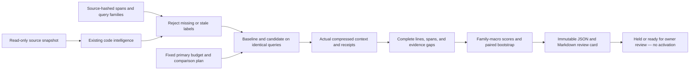

# Evidence-span retrieval evaluation

Retrieving the right file is only half the job. An agent still cannot use a branch condition,
return value, or dependency that its compressed context leaves out. This evaluator measures
the evidence actually sent in a code-context pack, alongside the existing file-level benchmark.

It combines three practical controls: source-bound line labels, paired task-family comparisons,
and a fixed-budget review gate. The supplied CLI uses credential-free retrieval with no LLM
calls. It does not retrain a ranker or change serving.



## What is measured

Each required span identifies a repository-relative path, an inclusive line range, and the
SHA-256 of its normalized source text. Evaluation rejects missing targets, changed source,
overlapping labels, and duplicate queries. Overlapping evidence cannot be split into new
families merely to increase the apparent sample size.

The evaluator reads the real `prompt_context`, checks its selected-file and snippet receipts,
and matches numbered lines against the source. A truncated line prefix does not count as
complete evidence. A selected filename alone earns no span credit. Compression gaps and
deduplicated lines remain missing unless that exact source location is actually present.

- File recall: relevant files selected in the packed context.
- Line recall: required source lines completely present.
- Complete-span recall: required spans with every labelled line present.
- Complete-evidence rate: queries retaining all required spans.
- Context precision: labelled evidence lines divided by visible source lines.
- Approximate tokens: the existing character-based pack estimate, not a model tokenizer.

Outcomes distinguish a file miss, compression loss, and partial evidence. JSON records missing
source ranges and lines; the Markdown card surfaces the primary-budget gaps. Neither report
contains raw queries or source snippets. Case IDs, family IDs, and source paths can still be
private metadata, so do not publish private study reports without review.

## Comparison protocol

The plan fixes the baseline, candidate, top-K, token budgets, primary budget, minimum family
count, recall floor, and maximum query-slice regression **before** execution. Secondary budgets
are descriptive: a good result at another budget cannot rescue a failed primary comparison.

Queries are averaged within each task family, then families receive equal weight. The paired
95% bootstrap resamples whole families while preserving baseline/candidate pairing. It does
not treat many paraphrases of one task as independent samples. Original/paraphrase slices
are reported separately and checked at the primary budget.

The review gate holds a candidate if there are too few families, the complete-span recall
floor is missed, the primary paired interval permits regression, a supported query slice
regresses, or a pack exceeds its approximate budget. Slices with fewer than two families
also hold the comparison. Synthetic labels always prevent `ready_for_owner_review`, even
when the numerical control gates pass. Human-review provenance requires a reviewer and a
timezone-bearing timestamp, but those fields are owner supplied, not externally authenticated.

This is an evaluation tool, not the shared prospective holdout registry or an activation
authority. It does not stop an operator rerunning exposed data with a different plan. A real
study needs independently reviewed labels, fresh families, a plan committed before inspecting
outcomes, and the appropriate exposure-governance process. Six families from one authored
fixture repository do not establish cross-repository generalization.

## Run it

```bash
python -m evals.retrieval_span_evaluation \
  --plan evals/experiments/retrieval_span_plan.json \
  --output data/evaluations/retrieval-spans/my-study-v1.json
```

This produces JSON plus a sibling Markdown card. Outputs are created exclusively: use a new
path for another run rather than overwrite old evidence. Input paths and indexed source are
protected; a real repository can keep reports under its excluded `data/evaluations/` directory.

The default study is deliberately synthetic: 12 queries, six task families, original and
paraphrased questions, and 256/512/1024-token budgets with 512 as the primary comparison.
It compares `lexical_graph` with `hybrid_rerank`, using hashing embeddings, feature reranking,
and deterministic parser fallbacks. No neural models are downloaded. The source fixture is
separate from its label dataset, so relevance labels cannot enter the index.

Both strategies achieve file recall `1.00` but complete-span recall `0.8333` at all three
budgets. The long report-rendering function loses its final assembly lines from context.
The paired span delta is zero: this is **not** a quality-gain claim. It is a concrete demonstration
of a failure that file-only evaluation misses. The study remains held because its labels are
synthetic. CI uploads its report without interpreting that hold as a code failure.

Use `--repository-root`, `--dataset`, and `--plan` for another corpus. At a Git root, the existing
workspace harness uses tracked, LF-normalized source; non-Git fixture roots use bounded file
discovery. Labels live outside the indexed source corpus. Compute a label digest with
`span_digest(source.splitlines(), start_line, end_line)` after reviewing the required evidence.
Do not blindly refresh a changed digest: review whether the labelled lines still answer the task.

`--require-gate` returns exit code 1 for a held study; invalid inputs, stale labels, and unsafe
output paths return 2. The synthetic defaults are expected to fail this strict review check.
Neither a normal exit nor a review-gate pass changes any serving configuration.

## Limits

Plans also accept `baseline_packing` and `candidate_packing` (`legacy` by default).
The [context-packing study](query-aware-context-packing.md) holds both rankers constant and
compares `legacy` with `balanced_v1`. Balanced receipts seal source ranges and packing
diagnostics; the evaluator independently verifies them against complete visible lines.

Span labels measure evidence availability, not factuality, answer quality, or successful patches.
Exact location grading deliberately does not infer semantic equivalence from a duplicate in
another file. Family bootstrap intervals are approximate, especially for small samples, and do
not establish statistical independence across repositories. Improve the evidence with additional
private, independently labelled repositories and downstream coding-agent experiments before
making resume claims about quality improvements.
