# Learning from reviewed execution outcomes

Search models learn from authored simulations today. The next useful dataset is what the agent
actually did, paired with a later review of whether its answer was correct. This upgrade connects
adaptive deliberation to that feedback loop without pretending that planned actions were executed.

The runtime records candidates that completed generation and grounding verification and were
evaluated by the answer selector. It does not record simulated MCTS transitions, failed calls,
early-exit answers, raw prompts, answer text, evidence text, or invented action propensities.
Token counts are the runtime's output-length estimates, not provider billing measurements.

```mermaid
flowchart LR
    Consent{Request consent and tenant identity} -->|yes, capture enabled| Generate[Generate and verify candidates]
    Generate --> Select[Existing bounded answer selector]
    Select --> Answer[Release or abstain unchanged]
    Select --> Replay[(Private signed observations)]
    Replay --> Review[Delayed trusted operator review]
    Review --> Labels[Correct, incorrect or ambiguous plus safety flag]
    Labels --> Group[One fixed candidate per request]
    Group --> Split[Stable request-group calibration and test split]
    Split --> Fit[Fit on calibration labels only]
    Fit --> Test[Held-out coverage and risk checks]
    Test -->|insufficient or regressed| Hold[Keep current calibrator]
    Test -->|passes on runtime observations| Candidate[Save candidate artifact and lineage]
    Candidate --> Owner[Manual review before deployment]
```



## Capture and privacy

Capture is off by default. Enable `EXECUTION_REPLAY_ENABLED`, configure an independent random
`EXECUTION_REPLAY_KEY` of at least 32 bytes, and send `execution_replay_consent: true` in a request.
Consent must be a JSON boolean, not a string. It applies to that request, not every future turn.
The service supplies the authenticated user identity and a fresh request ID; a conversation ID
is not reused as a training-group ID. Anonymous requests do not enter the replay store.

The SQLite store uses HMAC-keyed tenant, request, candidate and reviewer identifiers. Observation
and label signatures cover all stored metadata. A label also binds its observation's signature.
Tenant-scoped reads and reviews reject mismatches; conflicting observation retries and label
corrections fail rather than silently replacing previous data. Repeating an identical operation
is idempotent. Runtime persistence failures leave answer verification and release policy unchanged.

HMAC provides pseudonymization and integrity, not encryption or proof that a reviewer is honest.
The CLI is a trusted operator tool with access to the signing key, not a public feedback API.
Keep the store, its backups, keys and exports private and protect them with filesystem access
controls. The default runtime directory, including SQLite sidecars and exports, is Git-ignored.
Labels require the operator to inspect the answer in its original authorized context; no content
is copied into this store. Use unique request IDs in direct graph integrations too.

```bash
python -m agent.execution_replay --tenant YOUR_USER_ID list
python -m agent.execution_replay --tenant YOUR_USER_ID review EVENT_ID --verdict correct --reviewer REVIEWER_ID
python -m agent.execution_replay --tenant YOUR_USER_ID review EVENT_ID --verdict incorrect --unsafe --reviewer REVIEWER_ID
python -m agent.execution_replay --tenant YOUR_USER_ID export
```

Use `ambiguous` when a reliable correctness label is unavailable. Such labels are retained for
audit but excluded from calibration. A `correct` label with `--unsafe` becomes an incorrect
training target. Reviews are immutable; conflicting corrections require an explicit data-governance
decision outside this workflow, not a second CLI review that rewrites history.

`delete-tenant` removes that tenant's observations and cascades its labels. It is a logical SQLite
delete, not secure erasure of disk pages or backups. Exported snapshots and already-created model
artifacts are not automatically deleted or unlearned; invalidate or remove those separately.

## A gate, not automatic self-training

Candidate selection for the dataset happens before examining labels: use the released candidate,
or the smallest opaque event ID if none was released. Other sibling candidates are excluded.
If that fixed candidate is unreviewed, do not substitute a reviewed sibling. This avoids
label-dependent cherry-picking and counting related candidates as independent test samples.

A versioned HMAC split puts each request into calibration or test, approximately 75/25. It is
stable across repeated exports with the same key. Calibration fitting and artifact fingerprints
depend on calibration rows only. The lineage manifest binds both splits' observations and labels
for audit. Keep the key fixed while collecting a cohort; key rotation changes the grouping and
split identifiers and needs an explicit migration.

The gate requires at least 20 distinct reviewed request groups in each split, at least 20
held-out examples for each evaluated route, and sufficient route calibration support. Held-out
coverage must reach 20%. The upper endpoint of the two-sided 95% Wilson error interval must be at
most 20%, overall and per route. Any unsafe held-out release fails the gate; the error-rate
allowance cannot excuse a safety violation. Zero released answers cannot pass. Decisions abstain on
confidence values outside the fitted calibration range, matching the runtime's OOD behavior.

```bash
python -m evals.replay_calibration --tenant YOUR_USER_ID --require-gate
# Optionally require no measured coverage/risk regression against the incumbent:
python -m evals.replay_calibration --tenant YOUR_USER_ID --incumbent PATH_TO_CURRENT_CALIBRATOR --require-gate
```

Passing writes a candidate to `data/execution-replay/candidate-calibrator.json`, not to the active
runtime path. The command rejects an output path equal to the configured active path or supplied
incumbent. It uses `UNCERTAINTY_INTEGRITY_KEY` to seal the artifact for the existing runtime loader.
The gate report records exclusions, sibling counts, split lineage, per-route metrics, optional
incumbent metrics and reasons to hold. Unknown calibration routes are excluded rather than relabeled.

This is a reviewed-feedback calibration loop, not a new foundation-model fine-tune or offline-RL
trainer. The group split is not a chronological or task-family holdout. Review selection can still
bias the data, repeated use of the same holdout can overfit decisions, and request groups are not
proof of independent task families. Wilson intervals and conformal guarantees rely on sampling
assumptions that live traffic may violate. Freeze review cohorts, audit reviewer quality, collect
representative route coverage, and use a fresh time/task-family-separated evaluation before a
production rollout. A passing report does not establish quality on unsupported routes.

For that stronger check, use the [forward-time validation workflow](prospective-ai-validation.md).
It adds pre-execution task-family assignments, chronological label cutoffs, an embargo, frozen
membership, one-use holdout tracking, distribution-shift checks and paired incumbent comparisons.
The original HMAC request split remains available as a lighter exploratory calibration workflow.

## Reproduce the controls without credentials

```bash
python -m evals.replay_calibration --drill --require-gate
python -m pytest -q tests/test_execution_replay.py
```

The drill creates 240 synthetic observations and delayed fixture labels in a temporary database.
It checks grouped recalibration, synthetic-data exclusion, cross-tenant isolation and tamper
rejection. It cannot save a production candidate or measure live-model accuracy. CI uploads the
explicitly synthetic control report. Unit tests additionally check unsafe held-out labels,
train/test label separation, abstention-only models, actual stubbed runtime integration, deletion,
strict consent, conflicting retries, label integrity and missing-key behavior.

In the local synthetic drill, the fixed group split contains 187 calibration requests and 53
held-out requests. The candidate releases 40 of those 53 cases (75.5% coverage), with zero fixture
errors or unsafe releases; the Wilson error upper endpoint is 8.8%. These are control-test results,
not observed user accuracy, and the report marks production eligibility false.
