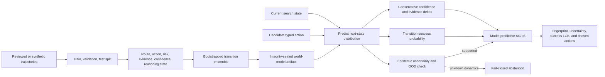

# Learned world-model planning

MCTS is only as useful as the transitions it imagines. The original AgentForge planner used fixed
rules such as “retrieval adds 0.08 confidence” and “reasoning adds 0.10.” Those rules made the search
replayable, but they treated every route and state as if actions had the same effect. This upgrade
learns those effects from trajectory transitions instead.



## What is learned

Each training row is a before/action/after transition. The model uses route and action one-hot
features plus evidence count, confidence, risk, and whether reasoning or verification has already
happened. Route-action and action-state interactions let it learn, for example, that a valid verified
answer should preserve confidence while an answer attempted before verification often fails and can
reduce it.

Three deterministic bootstrap members independently predict confidence delta, evidence delta, and
transition success. A validation-selected temperature calibrates the success probabilities. Their
mean is the expected transition. Their disagreement estimates epistemic
uncertainty; regression residuals represent observed noise. Planning uses lower confidence bounds,
with a larger penalty for high-risk requests. An unsupported route or excessive ensemble
disagreement marks the transition out of distribution and removes answer actions from the search.

The artifact records its feature schema, supported routes and actions, dataset fingerprint, member
fingerprints, thresholds, and an overall SHA-256 fingerprint. Loading a modified artifact fails
before it can influence a plan. Every emitted search plan also records the artifact fingerprint,
maximum transition uncertainty, minimum transition-success lower bound, and whether OOD fallback
was used.

## Reproduce the held-out gate

```bash
python -m evals.world_model_evaluation \
  --artifact data/evaluations/world-model/world-model.json \
  --output data/evaluations/world-model/report.json \
  --require-promotion
```

On the checked-in ten-transition synthetic holdout, learned confidence-delta MAE is `0.00574`, versus
`0.01000` for the fixed transition rules, a 42.6% reduction. Transition-success Brier score improves
from `0.10000` to `0.02867`, a 71.3% reduction. All unseen-route and injected member-shift probes are
detected; the supported planning case reaches a verified answer, while both the unknown-route and
member-shift cases abstain. CI retrains the model and reruns the gate on every change.

These results demonstrate the implementation and promotion mechanics, not general real-world agent
dynamics. The seed data is small and mostly authored. A production rollout should replace it with
privacy-reviewed execution traces, split by time and task family, evaluate several random seeds, and
monitor calibration and OOD recall after deployment.

## Enable it

Generate the artifact first, then enable it alongside verifier-guided search:

```dotenv
VERIFIER_MCTS_ENABLED=true
WORLD_MODEL_ENABLED=true
WORLD_MODEL_PATH=data/evaluations/world-model/world-model.json
```

The feature is opt-in. With it disabled, the prior deterministic transition rules remain available
as an explicit ablation baseline. If it is enabled but the artifact is absent or fails integrity
verification, adaptive deliberation fails closed instead of silently falling back.
