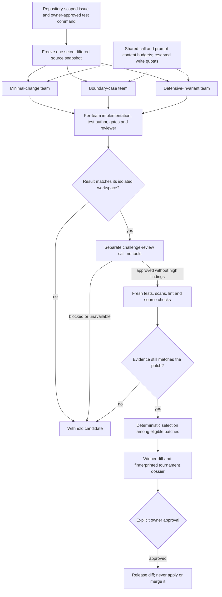

# Multi-agent repair tournament

One plausible fix is not always the right fix. The repair tournament lets several coding
teams investigate the same issue independently, then chooses from patches that survive
both execution checks and an additional challenge review. It returns one proposed diff,
not a merge of competing agents' edits. The owner still decides whether to release it.

## How it works



The default tournament has three teams and runs at most two concurrently. Each team reuses
the verified-PR pipeline: analyst, implementer, restricted test author, independent reviewer,
and bounded repair. A fourth compatibility-focused team is optional. Role prompts differ,
but all use the configured model; this is not statistical independence between model families.

Every team receives its own temporary workspace and container, copied from the same frozen
snapshot. The snapshot and original repository are checked for changes. A bad source
fingerprint, reused workspace, or exceeded global deadline blocks publication. Competing
patches are never applied to the original or to each other.

## What makes a candidate eligible

Completion text and an approving model are insufficient. The actual workspace diff must
match the reported patch and changed-file list. The final test command must be the exact
owner-approved command and must pass without timing out. Required scope, secret, unsafe-code,
test, and source-integrity gates must be present and passed; high/critical review findings
block eligibility even if a model inconsistently says `approved=true`.

Eligible patches receive a separate challenge review looking for counterexamples, missing
boundary tests, weakened assertions, and scope/security defects. It has no tools or write
authority. A failure, timeout, excessive input, or rejection withholds that candidate. The
workflow then reruns deterministic gates, including fresh tests, and rejects a patch that
changed after review. This fresh pass deliberately uses strict Ruff checking rather than
waiving pre-existing lint failures as the original pipeline can.

Selection is intentionally simple: fewest changed files, then fewest added/deleted lines,
then smallest patch, then candidate ID. It is completion-order independent, not an LLM vote
or a learned correctness score. Smaller is only a tie-break preference after eligibility;
passing available tests and reviewers is not proof that every requirement is correct.

The receipt records all candidate dispositions, patch/review digests, fresh gate statuses,
shared reservations, unique eligible patch count, selection rule, and winner. Duplicate fixes
are reported as duplicates, not claimed as diversity. Losing patch bodies are not persisted
in the tournament dossier. Receipt digests detect changes; they are not external signatures.

## Budgets and resource limits

- The existing total workflow-write budget is divided into fixed per-team quotas. Each team
  needs at least two reserved writes; division can leave an unused remainder.
- An atomic shared ledger reserves model invocations and approximate prompt-content tokens
  before dispatch. Failures consume reservations; denied requests never reach the provider.
- These are logical `ainvoke` calls, not physical provider requests: SDK retries can make extra
  network attempts. The character-based prompt estimate excludes schema/tool overhead and
  output tokens; it is not a hard dollar or provider-token cap.
- Provider usage reported by callbacks is aggregated across all calls, including losing or
  failed teams and challenge calls. Missing usage is marked incomplete; zero reported cost
  is not evidence of free inference. Prices are operator-supplied estimates.
- Team, challenge, and global deadlines withhold late results. Blocking startup and cleanup
  can outlast a deadline because cancellation cannot stop a Python thread. Cleanup waits for
  startup and destroys branch containers; a killed host still needs operational recovery.

Container CPU, memory, PID, network, and command-time limits remain those of the existing
sandbox policy. Two concurrent teams can use twice a single container's configured resources.
Concurrent worker jobs multiply that further; keep worker concurrency low on a laptop.

## Run it deliberately

The existing `verified_pr` workflow stays the default. To opt in on a Docker-capable worker:

```dotenv
CODE_AGENT_WORKFLOW=repair_tournament
CODE_TOURNAMENT_CANDIDATES=3
CODE_TOURNAMENT_MAX_PARALLEL=2
CODE_TOURNAMENT_MAX_MODEL_CALLS=64
CODE_TOURNAMENT_PROMPT_TOKEN_BUDGET=100000
CODE_TOURNAMENT_CANDIDATE_TIMEOUT_SECONDS=300
CODE_TOURNAMENT_CHALLENGE_TIMEOUT_SECONDS=60
```

Use the same authenticated task submission and approval API. Requests cannot choose the
workflow or raise these operator budgets. Patch release remains approval-gated; SQLite
stores the tournament metadata and the JSON/Markdown dossier alongside the winner artifact.

For a real coding benchmark, explicitly freeze the policy:

```bash
python -m code_agent.evaluation evals/datasets/code_agent_smoke.jsonl \
  --repository-root tests/fixtures/code_repositories \
  --workflow repair_tournament \
  --tournament-policy evals/experiments/repair_tournament_policy.json
```

This command uses configured models and Docker and can incur provider charges. The
`repair_tournament_matrix.json` matrix adds verified-team, one-team-plus-challenge, and
three-team-plus-challenge arms using the existing dataset lock. Tournament variants require
explicit policies; configuration fingerprints retain them. Replace the authored smoke tasks
with fresh, independently reviewed repositories before making a quality claim.

## Optional pre-patch regression designer

The [independent regression-challenge agent](regression-challenge-agent.md) proposes bounded JSON function-call probes before teams start. It sees operator-selected baseline modules, not candidate patches. A stable, error-free baseline mismatch is required; candidates then run the common suite twice in Docker before fresh owner gates. Failed, unstable, or workspace-mutating probes hold the patch. Exact expectations remain in the owner's JSON dossier because generated oracles can be wrong. This stage is off by default and shares the existing inference budget.

## Review the credential-free controls

```bash
python -m evals.repair_tournament_evaluation \
  --output data/evaluations/repair-tournament/my-review-v1.json
```

Seven scenarios exercise a focused fix, wrong first fix, unsafe first fix, provider outage,
challenge veto, deadline, and exhausted shared-call budget. They use the real specialist
pipeline and confined workspaces, but scripted model outputs and authored command outcomes.
No provider is called and no fixture code is executed on the host.

The controls demonstrate recovery and withholding contracts—not real model accuracy or
SWE-bench improvement. The focused-fix control uses 6 logical calls with one team versus
18 with three teams: exploration has an explicit cost. Deadline call counts can vary with
startup timing. CI fails unexpected control outcomes, uploads a review card, and never
executes the live matrix or activates this workflow. Reports remain held; `--require-gate`
returns 1 even when orchestration controls pass.

For a resume, describe the engineering capability accurately: “Built an isolated multi-team
coding workflow with shared inference budgets, challenge review, execution-gated selection,
and human-approved diffs; tested recovery and fail-closed behavior with controlled ablations.”
Add measured resolution/cost gains only after a genuine downstream benchmark.
