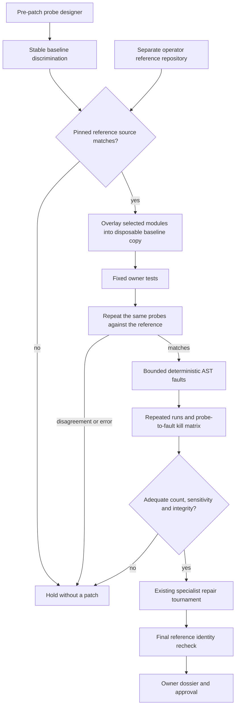

# Reference-calibrated probes and mutation sensitivity

A generated test can be confidently wrong. The regression designer already runs before any repair is authored, but a stable baseline failure does not establish that its expectation is correct. This optional stage asks two further questions: does the probe agree with an operator-approved reference, and can it distinguish controlled faults from that reference?

It is a validation gate, not another answer-generating agent. The reference and mutant implementations never enter model prompts, candidate workspaces, or the published diff.



## Reference agreement without solution leakage

The operator supplies a separate absolute reference-directory path and its SHA-256 identity. The worker rejects reference/task repository overlap before calling the designer. It snapshots the reference through the existing secret/file filters and checks the frozen snapshot against the pinned identity. Text CRLF is normalized for a portable source identity; other content changes remain significant. Symlinks, `.env` files, key files, and excluded runtime directories are not reference inputs.

Only modules containing the suite's explicit function targets are overlaid onto a disposable copy of the baseline. The baseline's tests and other dependencies remain in place. The fixed owner command must pass without changing the reference overlay. Every proposed probe must then match the reference in two fresh processes with stable outcomes and no workspace mutation.

The source is checked again after calibration and immediately before selecting a winner. A changed or unavailable reference blocks publication; a later matching read does not clear an already recorded revocation. This is source-version binding, not proof that the operator's reference is correct or cryptographic attestation of container execution.

## Mutation sensitivity and redundancy diagnostics

The controller parses Python and generates deterministic, single AST edits inside the selected synchronous function bodies:

- comparison flips;
- disabled guards;
- `min`/`max` swaps;
- arithmetic swaps.

No mutation code is generated by a model or executed on the host. Each mutant runs the full suite twice in the same isolated verification container, with the original overlay restored between mutants. A stable mismatch is a detected fault. Exceptions, timeouts, invalid receipts, unstable outcomes, and workspace changes are **invalid evidence**, not successful kills. They count against eligibility rather than inflating the score.

The receipt includes the mutation operator, source digest, per-probe outcomes, killing probe indices, survivors, total score, and controller-command count. A deterministic greedy set-cover diagnostic identifies probes covering the observed kills. It is not a proven minimum and never shortens the suite used to gate candidates.

The default policy requires at least two mutants and a score of `1.0`, with a cap of four. Equivalent mutations, untested branches, stateful functions, and a truncated fault inventory can cause conservative holds. The score describes only the selected faults—not general code coverage, semantic correctness, or resistance to arbitrary bugs.

## Explicit configuration

This stage is disabled unless `regression_challenges.oracle_calibration` is present. The checked-in `evals/experiments/oracle_calibration_policy.json` is only for the authored clamp example. Production references belong on an isolated worker, not an internet-facing API host or inside task repositories.

To identify your own reference:

```bash
python -c "from pathlib import Path; from code_agent.oracle_calibration import reference_fingerprint; print(reference_fingerprint(Path('/absolute/private/reference')))"
```

Use that hash in an operator-reviewed policy. Do not automatically rewrite a pinned hash when a mismatch occurs. Required fields and conservative defaults are:

```json
{
  "reference_sha256": "<64-character source identity>",
  "max_mutants": 4,
  "min_mutants": 2,
  "min_mutation_score": 1.0,
  "timeout_seconds": 180
}
```

For the authored example in PowerShell:

```powershell
$env:CODE_TOURNAMENT_REFERENCE_REPOSITORY = (Resolve-Path -LiteralPath 'evals/fixtures/oracle_reference').Path
python -m code_agent.evaluation evals/datasets/regression_challenge_smoke.jsonl --repository-root evals/fixtures --workflow repair_tournament --tournament-policy evals/experiments/oracle_calibration_policy.json
```

That live run requires provider credentials and Docker and can incur charges. It is not run by CI. The policy, including the reference hash and thresholds, enters the benchmark configuration fingerprint; the host path does not enter the result dossier.

Calibration finishes before teams start. It adds no provider calls and at most `1 + 2 × (1 + max_mutants)` controller commands: owner tests, repeated reference probes, and repeated mutant probes. Containers run sequentially without increasing candidate parallelism. Phase, command, and overall task deadlines apply; safe cleanup can outlast a deadline but cannot authorize a late patch.

## Reproduce the authored controls

```bash
python -m evals.oracle_calibration_evaluation --output data/evaluations/oracle-calibration/my-review-v1.json
```

The toy experiment compares three authored suites:

| Suite | Reference agreement | Expected fault sensitivity | Decision |
|---|---|---|---|
| Boundary and preservation probes | Yes | 4/4 faults | Eligible for the next gate |
| One lower-bound example | Yes | 2/4 faults | Hold for weak sensitivity |
| Incorrect expected output | No | Not evaluated | Hold for oracle disagreement |

CI builds the allowlisted image, runs these Docker controls without a provider, and uploads JSON/Markdown. Local test doubles explicitly disclose authored execution. Docker absence returns unavailable, never a host fallback or simulated Docker result. Reports remain `held`; `--require-gate` returns nonzero even when controls pass. No automatic serving activation occurs.

## What this demonstrates

The engineering contribution is evaluation of the evaluator: independent pre-patch probes, reference-version governance, fault-sensitivity measurement, private solution isolation, and fail-closed selection. Reference correctness, live-model oracle accuracy, and real-world resolution gains remain unmeasured. The human approval boundary is unchanged.

Local verification: 27 focused tests passed with one Docker skip on both Python 3.11 and 3.13. Combined statement/branch coverage for the new runtime and evaluator was 95.7%. The affected agent, retrieval, approval, and service suite passed 238 tests with five skips. The expanded full suite was not rerun. Docker was unavailable locally, so no real reference/mutant execution result is claimed; CI is configured to run and upload the authored Docker controls.
