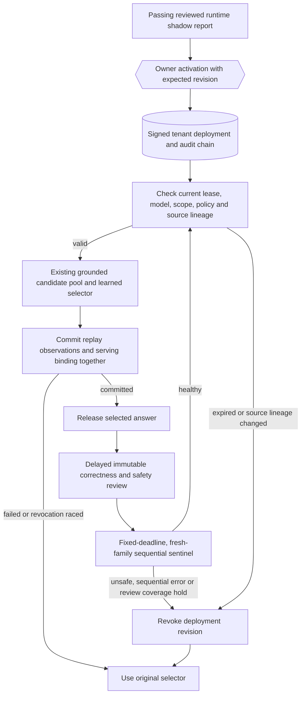

# Keep a learned selector accountable after activation

The shadow study answers whether a learned selector looks better on reviewed future task families. Its signed approval alone is an offline lease: deleting source evidence does not invalidate that file immediately. This upgrade closes that gap for deployments using the optional registry.

An owner activates an approved model for a tenant, with its exact compute policy, route/risk scopes, and a fixed monitoring policy. Each subsequent learned selection checks the live evidence and the delayed outcomes of earlier selections. A failed check returns control to the original PRM/confidence selector. Nothing here generates new answers or makes extra model calls.



## What changed

The registry lives in the existing private replay SQLite database. It stores the metadata-only ranker, signed approval, frozen shadow cohort, pinned policies, keyed tenant and owner IDs, and signed state revisions. There are no prompts, answers, citations, reviewer names, or raw tenant IDs in these records. Keep the database and signing keys private; `data/` remains Git-ignored.

Activation and revocation use expected revisions, so a stale operator or worker cannot silently overwrite a newer deployment. State revisions form a verified hash chain. An approval can activate only once: revocation cannot be undone by resetting its monitoring policy or replaying the same approval. A genuinely new passing cohort and approval are needed for a new deployment. No evaluation automatically activates or renews a model.

The registry-mode runtime loads the tenant's sealed model from the registry, not the global artifact path. Before selection it checks the approval against the model, exact compute policy, requested route/risk scope and time, recreates the approval cohort from current source records, and evaluates the sentinel. Unsupported request scopes fall back without revoking unrelated scopes. Deleted or altered approval or serving evidence blocks admission. The original file-only activation path remains available for backward compatibility, but does not provide these live checks.

Serving bindings are written in the **same SQLite transaction** as replay observations. They identify the actual selected event and its preassigned task family before any review exists. Source lineage and earlier outcomes are checked again while the writer lock excludes concurrent changes. Failed persistence or a revision change before commit rolls back both and releases only the baseline choice. Exact retries remain idempotent. A reviewed unsafe event blocks further learned selection even if it is ambiguous, early, or belongs to a repeated family.

## A sequential guard, not repeated confidence-interval peeking

By default, each review has one hour from capture. The earliest captured request in each genuinely new task family is its representative; review availability cannot pick a replacement. Families already seen before activation do not enter the statistical stream, though unsafe outcomes from any recorded choice still block admission.

Each scope processes its contiguous, matured event-time prefix. A family is a monitored error if its selected answer is incorrect or unsafe, or if a usable review did not arrive by the fixed deadline. Ambiguous and late reviews count as review-SLA failures. A late favourable label cannot erase an earlier error.

For errors `X` in `{0,1}`, the fixed likelihood-ratio betting factor is `q/p` for an error and `(1-q)/(1-p)` otherwise, with defaults `p=0.2`, `q=0.5`. The sentinel accumulates these factors in log space and retains every earlier threshold crossing. The threshold is `number_of_approved_scopes / alpha`, with `alpha=0.05`. This follows the test-martingale framework described by [Shafer et al., Statistical Science](https://arxiv.org/abs/0912.4269).

The conditional-null assumption is important: **each next combined correctness/review-SLA error must have probability at most `p`, conditional on previous information**. Under that null, each factor has conditional expectation at most one; Ville's inequality and scope-wise alpha allocation bound an anytime crossing within one deployment. This is not a guarantee about biased human labels, causal model lift, independence of hand-labelled semantic families, or all future deployments combined.

Unsafe outcomes and the separate 80% timely-review coverage rule (after 20 mature families) are operational safeguards, not part of that false-alarm bound. Their actions can be more conservative. The sentinel never promotes a model or claims that a low e-value proves quality. A long healthy prefix can also delay detection of later degradation; this initial fixed-bet test is not a change-point detector.

## Try the failure controls

```powershell
python -m evals.preference_deployment_evaluation drill --require-gate
```

The drill keeps healthy reviewed selection active and blocks incorrect answers, missing reviews, a known unsafe selection, source deletion, and owner revocation. Fixtures deliberately use runtime-shaped records in isolated temporary stores to exercise activation; they are authored synthetic controls, not human-reviewed production evidence. No release artifacts, activation keys, or private database are exported by the drill.

## Activate after reviewing real evidence

First collect and evaluate a [runtime shadow cohort](preference-shadow-validation.md). Use the same replay DB, tenant, independent replay/ranker keys, and shared holdout ledger. Activation rechecks the cached report and live lineage before accepting its approval.

```powershell
python -m evals.preference_deployment_evaluation --tenant YOUR_TENANT activate --artifact data/evaluations/preferences/candidate.json --cohort data/execution-replay/shadow-cohort.json --approval data/evaluations/preference-shadow/candidate-approval.json --owner YOUR_OWNER_ID --expected-revision 0
python -m evals.preference_deployment_evaluation --tenant YOUR_TENANT status
```

For a non-default compute policy, add `--compute-policy` with the same JSON used in the study. An optional `--sentinel-policy` JSON pins `SentinelPolicy` at activation; it cannot be edited in place. Existing tenants use the revision shown by `status`, not `0`. The CLI requires access to signing keys and is a trusted local operator tool, not a public authorization endpoint.

After owner review, enable:

```env
PREFERENCE_RANKING_ENABLED=true
PREFERENCE_SHADOW_ENABLED=false
EXECUTION_REPLAY_ENABLED=true
PREFERENCE_DEPLOYMENT_ENABLED=true
```

Restart the service. Each request must still provide a tenant, stable request ID, explicit replay consent, and a preassigned task-family ID. Missing consent, keys, valid scope, or an active deployment preserves the baseline; the registry never silently opts a user into retention.

```powershell
python -m evals.preference_deployment_evaluation --tenant YOUR_TENANT check --route rag
python -m evals.preference_deployment_evaluation --tenant YOUR_TENANT revoke --expected-revision 1
```

`status` is diagnostic. `check` applies the live guard and may revoke; every registry-mode runtime admission does the same. Revocation switches **subsequent admissions** to the baseline. A choice already committed can be in flight, and this reference design cannot retract it. Without new requests or an operator `check`, there is no background watchdog or notification service.

Deleting a tenant removes its observations, labels, comparisons, serving bindings, deployments and private audit records. The separate opaque holdout ledger remains to prevent reuse. Deleting an individual source leaves the serving exposure intact so admission detects the missing lineage.

This is a single shared-SQLite reference deployment control, not a multi-region registry. It scans tenant metadata synchronously and has no external audit anchor: a privileged database/key owner can roll back storage. Distributed transactions, external append-only audit anchoring, automated review sampling, latency/load benchmarks and change-point monitoring remain future work.
