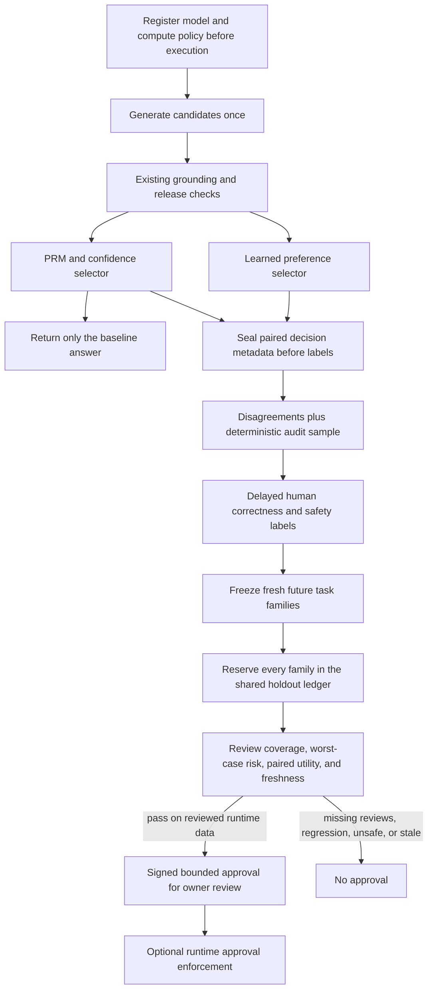

# Test a learned selector without changing answers

The preference model can learn useful metadata correlations, but the earlier offline evaluation compared it with a confidence-first proxy. The live agent also uses process rewards, consensus, grounding, conformal decisions, and compute budgets. Before enabling a new selector, we should measure it against **that actual baseline**.

This iteration adds non-serving shadow comparisons, a review queue, and a prospective approval gate. Both selectors see the same already-generated candidates. The user receives the original PRM/confidence selector's answer. Shadow mode makes no additional model calls and cannot unblock an abstention.



## What is retained

A comparison stores keyed tenant/request/candidate identifiers, source observation fingerprints, the two selected event IDs, process-reward values, grounding/conformal eligibility, consensus, confidence thresholds, model identity, and signed receipt bindings. It contains no answers, prompts, evidence text, raw answer hashes, raw tenant IDs, or reviewer names.

Study registration is immutable and precedes captured requests. Captures verify the original receipts, identical candidate pools, unchanged generation accounting, registered model/policy, and source observations. A comparison cannot be created after a review label already exists. Exact retries are allowed; conflicting retries are rejected. Tenant deletion removes observations, labels, private shadow comparisons, and study registrations. The separate opaque holdout exposure ledger is retained to prevent reuse.

This provides a same-candidate **selector comparison**, not an online randomized experiment. It cannot measure effects of generating different candidates, user satisfaction, whole-agent factuality, or causal traffic lift.

## Review and evaluation

The queue prioritizes disagreements and includes a deterministic, outcome-independent sample of unchanged decisions. Use `--audit-percent 100` to list every pending comparison. Existing replay review commands attach immutable delayed labels; if both selectors choose the same event, one label covers both. Reviewers still need their own approved access to the original output—the queue intentionally does not retain answer text. Ambiguous labels are excluded from scored pairs and cannot be silently relabelled.

Evaluation fixes the earliest request per task family **before examining review coverage**. Families must first appear after study registration plus an embargo, including any earlier appearances in the replay that had no shadow comparison. Repeated requests cannot substitute for missing reviews. Baseline abstentions remain abstentions and are reported as excluded from the baseline-released cohort.

The gate requires at least 20 reviewed families per route/risk scope, at least 80% paired review coverage, and differences on at least 20% of captured choices. It also requires zero reviewed unsafe shadow choices, a ≤20% Wilson 95% upper error bound, and nonnegative family-paired bootstrap lower utility bounds. Utility is +1 for safe correctness and −4 otherwise.

Missingness is handled conservatively: unreviewed outcomes count as errors in the risk bound; an unreviewed disagreement gets a worst-case −5 utility delta; identical choices have zero paired delta even when unreviewed. Both complete-case and worst-case bootstrap bounds must pass. At small sample sizes this can require substantially more than 80% review coverage. These checks reduce review-selection optimism; they do not turn biased human labels or repeated semantic templates into independent real-world evidence.

The shared ledger reserves **all cohort families, including unreviewed ones, before scoring**. Freeze after review is ready: later labels cannot improve a cached report, and a new snapshot cannot reuse already exposed families. Cached retries validate current lineage; deleted or changed sources block reuse. Pending reservations from interrupted evaluations require operator audit. Protect the DB and signing keys; replacing them bypasses this operator control.

## Try it without credentials

```powershell
python -m evals.preference_shadow_evaluation drill --require-gate
```

The authored control has 40 new shadow families. The actual PRM-first baseline selects 20 correctly; the learned shadow selector selects 40 correctly while **no served choice changes**. Controls with 50% reviewed coverage or inverted/unsafe outcomes fail. Synthetic evidence cannot issue a production approval. These numbers validate mechanics, not production quality or savings.

## Collect reviewed runtime evidence

Start with a human-reviewed, tenant-bound ranker from [preference learning](reviewed-preference-reranking.md). Set the existing replay and ranker keys locally; never commit them. Register a study with the exact runtime compute policy before enabling shadow capture:

```powershell
python -m evals.preference_shadow_evaluation --tenant YOUR_TENANT --artifact data/evaluations/preferences/candidate.json register --name preference-shadow-v1
```

For a non-default runtime policy, supply a `ComputePolicy` JSON file through the global `--compute-policy` option in registration and evaluation. Policy drift is rejected, not silently accepted.

Set `PREFERENCE_RANKING_PATH` to that candidate, `PREFERENCE_RANKING_ENABLED=false`, `PREFERENCE_SHADOW_ENABLED=true`, and `PREFERENCE_SHADOW_STUDY_ID` to the returned ID. Enable replay and explicit per-request consent, and assign task families before execution. Restart the service after changing configuration. If active reranking and shadow mode are both enabled, serving mode takes precedence and shadow capture is skipped; do not use that combination for a baseline study.

Review pending event IDs with the existing replay CLI, then freeze and evaluate fresh evidence:

```powershell
python -m evals.preference_shadow_evaluation --tenant YOUR_TENANT queue STUDY_ID --audit-percent 100
python -m evals.preference_shadow_evaluation --tenant YOUR_TENANT freeze STUDY_ID --embargo-seconds 3600 --output data/execution-replay/shadow-cohort.json
python -m evals.preference_shadow_evaluation --tenant YOUR_TENANT evaluate data/execution-replay/shadow-cohort.json --output data/evaluations/preference-shadow/report.json --approval data/evaluations/preference-shadow/candidate-approval.json --require-gate
```

Use the global `--artifact` option on freeze/evaluate too if the configured ranker path differs. Reports and frozen snapshots are immutable, exact retries are cached, and failed gates write no new approval. Output aliases of stores, SQLite sidecars, cohorts, policy/model inputs, or configured active model/approval paths are rejected. Private artifacts remain under Git-ignored `data/` paths.

## Activate only after review

No evaluation deploys anything. After inspecting a passing real-data report, the owner can turn off shadow mode, enable reranking, set `PREFERENCE_SHADOW_APPROVAL_PATH` to the candidate approval, and enable `PREFERENCE_RANKING_REQUIRE_SHADOW_APPROVAL=true`.

Approval enforcement is opt-in for backward compatibility; without it, the earlier owner-managed activation path still works. When enabled, the runtime checks the signing key, tenant, model fingerprint, exact compute policy, route/risk scope, and expiration. Missing or incompatible approval preserves the baseline. Evidence must be less than seven days old; the lease expires seven days after the oldest cohort comparison, and cached retries cannot renew it. Refresh using genuinely new families.

Approvals are offline leases, not continuous source-revocation lookups. Deleting source data blocks reevaluation but does not invalidate an already-issued approval file immediately. Remove that file or disable reranking for immediate rollback. Distributed revocation and a multi-tenant deployment registry remain future work.

This iteration also fixes an integer-versus-float default that broke preference artifact signatures after JSON reload. New artifacts use normalized defaults. Authentic legacy integer-default artifacts still load through an explicitly verified compatibility path; model behavior and fingerprint are preserved, and altered signatures remain rejected.
