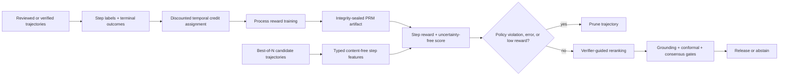

# Process reward modeling

Final-answer scores tell us whether an agent succeeded, but not where its trajectory went
wrong. AgentForge now learns a compact process reward model (PRM) over typed planning,
retrieval, tool, reasoning, verification, and answer steps. It gives adaptive compute a second
signal for best-of-N selection: confidence says what the candidate believes; process reward
estimates whether the path that produced it looks trustworthy.



## What is learned

The current model is deliberately small and auditable: logistic regression over twelve
content-free features. Those features describe step position and type, evidence availability,
citation validity, tool-policy authorization, execution failure, calibrated confidence, and
risk level. Prompts, answers, chain-of-thought, retrieved passages, and tool output are not
stored in the artifact.

When an explicit step label exists, it supervises that step directly. Otherwise, the trainer
propagates the verified terminal outcome backward with temporal discounting. Later steps carry
more outcome credit, and leave-one-step-out scoring produces a counterfactual contribution for
each receipt. Synthetic labels remain marked `synthetic_seed`; only records marked
`human_reviewed` contribute to the artifact's human-label count.

## Runtime behavior

The feature is opt-in. When enabled, each adaptive-compute candidate is represented as a
retrieve, reason, verify, and answer trajectory. The PRM score is attached to the existing
content-free candidate assessment. All deterministic grounding, conformal, consensus, token,
and latency gates still apply; the model only reranks candidates that already pass those gates.

The scorer also supports early pruning. A policy-denied or failed step stops immediately. Two
consecutive steps below the validation-tuned reward threshold stop a low-value trajectory.
Every decision emits a fingerprinted receipt with step rewards, counterfactual credits, the
pruned step, and the exact model artifact fingerprint.

## Reproduce the gate

```bash
python -m evals.process_reward_evaluation \
  evals/datasets/process_reward_trajectories.jsonl \
  --artifact data/evaluations/process-reward/model.json \
  --output data/evaluations/process-reward/report.json \
  --check evals/experiments/process_reward_model.json \
  --require-promotion
```

The checked-in five-group holdout is a deterministic synthetic seed. Confidence-only selection
succeeds on one of five groups and selects an unsafe trajectory in four; PRM reranking selects
the verified trajectory in all five and prunes every failed trajectory. This demonstrates the
learning and release machinery, not general LLM quality. A publishable result requires hidden,
human-reviewed trajectories sampled from the deployed models and tools.

## Enable it

Generate or copy the artifact to the configured runtime path, then enable both controls:

```dotenv
ADAPTIVE_COMPUTE_ENABLED=true
PROCESS_REWARD_MODEL_ENABLED=true
PROCESS_REWARD_MODEL_PATH=data/evaluations/process-reward/model.json
```

Artifact loading is integrity checked and hot-reloaded after a validated file replacement. If
the PRM is enabled but unavailable or modified, adaptive candidate scoring fails closed.

For higher-assurance deployments, the same scorer interface can load a calibrated bootstrapped
ensemble. MCTS and candidate selection then use a risk-adjusted lower confidence bound, abstain on
excessive member disagreement, and send uncertain metadata-only receipts to a human review queue.
See [uncertainty-aware verifier ensemble](verifier-uncertainty.md).
