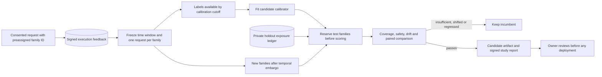

# Does a learned calibrator work on new task families?

The feedback loop can fit a correctness calibrator from reviewed outcomes. A random request split
does not tell us whether it survives a change in time, task families or traffic mix. This upgrade
adds a more conservative forward-time study and keeps its evidence separate from deployment.



## Family metadata is assigned before execution

Send `execution_replay_consent: true` and an `execution_replay_task_family` ID when submitting a
request. Use the same ID for related or near-duplicate tasks, not a new random ID per question.
For example, paraphrases of the same benchmark task belong to one family. The family ID is
optional for ordinary answering and the earlier request-group calibration workflow, but required
for this stronger study. Legacy observations are still readable; they are not retroactively
assigned families after their outcomes become known.

The service HMAC-hashes the family ID before placing it in graph/checkpoint/tracing configuration.
The private replay store signs the assignment and refuses conflicting or late assignments.
Direct graph integrations can supply `execution_replay_task_family_fingerprint` using the same
tenant-scoped HMAC helper. Avoid passing raw sensitive IDs in graph configuration. Family metadata
is removed alongside its tenant's observations and labels by the existing deletion command.

These are operator-provided grouping IDs, not proof of semantic independence. Auditing family
quality is necessary: calling every paraphrase a different family defeats the intended control.
No prompts, answer text, raw family IDs, or inferred RL propensities enter a frozen cohort.

## Time and label availability both matter

Pick a calibration cutoff in Unix UTC seconds and an embargo duration. Calibration observations
and their selected candidate's review label must exist by that cutoff. A training answer reviewed
later is excluded rather than letting a future label influence the fitted artifact.

Test families must first appear after the embargo. The study chooses the earliest request for
each family and then the answer selector's candidate, or its fixed opaque-ID fallback. Both
choices happen before looking at correctness or review availability. If the earliest request is
unreviewed or ambiguous, a later reviewed request is not substituted. One representative per
family keeps related requests from inflating the sample count. A family seen before the test
window cannot cross into test, even if some of its later requests would otherwise qualify.

Freeze a cohort after the observation and review window has closed:

```bash
python -m evals.prospective_evaluation --tenant YOUR_USER_ID freeze --cutoff CALIBRATION_CUTOFF_UNIX --embargo-seconds 3600 --output data/execution-replay/cohort-v1.json
```

The file binds the time window, membership, signed observations, labels, family assignments and
exclusions. Cohort output paths cannot be replaced by different cohorts. Evaluation verifies
live source lineage before scoring or returning cached evidence; deleted or changed source rows
invalidate the study's eligibility for a new evaluation. Historic reports and exported files
are not automatically erased, and this is not model unlearning.

## One holdout exposure, not unlimited tuning

```bash
python -m evals.prospective_evaluation --tenant YOUR_USER_ID evaluate data/execution-replay/cohort-v1.json --incumbent PATH_TO_CURRENT_CALIBRATOR --require-gate
```

Fitting uses calibration labels only. Before computing test metrics, the evaluator reserves every
test family's HMAC ID in a transactional SQLite ledger. A different candidate, policy, incumbent,
seed, cohort timestamp or overlapping subset cannot reuse an exposed family. Exact completed
retries return the signed cached report without rescoring test outcomes. A crash after reservation
leaves a pending study that requires an operator audit; it is not silently released for retuning.

Keep the ledger at its stable private path, `data/execution-replay/holdout-ledger.sqlite3`. Copying,
resetting, deleting or replacing that ledger can defeat reuse protection. HMAC detects payload and
index inconsistencies, not wholesale deletion of all audit history. Protect the store, ledger,
keys and backups with filesystem controls and retain audit snapshots. Key rotation changes family
IDs and needs an explicit exposure-history migration. Reservations are not removed by tenant
deletion; those opaque audit identifiers require a separate retention decision.

## What the gate checks

The existing calibration gate still requires at least 20 distinct representatives in each split
and each evaluated test route, adequate route calibration support, at least 20% coverage, a 95%
Wilson error upper endpoint no greater than 20%, and zero unsafe releases. Because this cohort
has one representative per family, those counts no longer count repeated requests as new units.

Additional checks measure confidence-histogram Jensen–Shannon divergence and route-mix total
variation. The defaults hold a candidate at confidence JS divergence of 0.15 or higher, or route
total variation above 0.25. They are content-free shift diagnostics, not semantic drift detection.

When an incumbent is provided, both artifacts see the same frozen families. A seeded paired
bootstrap produces 95% percentile intervals for coverage and an explicit utility score:
`+1` correct release, `-4` incorrect release, and `0` abstention. The lower endpoints must not fall
below a 0.02 non-inferiority margin. Existing point-estimate coverage/risk regression checks remain
in force. The report records resampling seed, 400 default replicates, score definition, thresholds,
cohort fingerprint, study identity, validated tenant/routes and every hold reason. Without an
incumbent there is no paired-comparison claim.
An externally supplied incumbent's training contamination cannot be inferred from its weights;
audit its dataset lineage before using it as a comparison baseline.

Passing saves only `data/execution-replay/prospective-candidate.json`. It never changes the active
runtime calibrator. Input files, database sidecars, the incumbent and configured active artifact
are protected against output-path collisions. All default private cohorts and ledgers are
Git-ignored. Review the study report against the exact candidate fingerprint before deployment.

## Reproduce the controls

```bash
python -m evals.prospective_evaluation drill --require-gate
python -m pytest -q tests/test_prospective_validation.py
```

The offline drill contains 80 synthetic calibration families and 80 new synthetic test families.
On clean fixtures it releases 60 test cases, with zero fixture errors or unsafe releases. The
challenger and identical incumbent have zero paired deltas: this is not evidence of improvement.
The shifted fixture changes incorrect-case confidence from 0.2 to 0.3. Its apparent coverage and
error stay unchanged, but confidence JS divergence reaches 0.25 and the candidate is held. The
drill also checks exact-retry caching and rejection of a changed study on the same holdout.
CI uploads only this explicitly synthetic control report, never a real user's private cohort.

This is a forward-time replay study, not a blinded, preregistered live A/B trial. Its safety and
statistical conclusions depend on representative sampling, honest reviews, good family grouping
and stable collection conditions. Bootstrap intervals are finite-sample diagnostics, not universal
guarantees; simultaneous route checks are not a multiple-testing-corrected theorem. Evidence from
one tenant or route does not establish global quality. Choose windows before inspecting outcomes,
collect fresh authorized families, audit reviewers, and validate broader traffic before a rollout.
