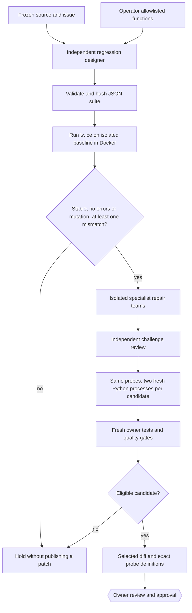

# Independent regression-challenge agent

A repair can pass the existing tests by fixing one example while missing the surrounding boundary. This optional stage gives the repair tournament a common behavioral suite designed **before any candidate patch exists**.

The designer sees the issue and original source of operator-selected Python modules, not candidate patches, repair traces, or reviewer verdicts. It produces bounded JSON calls—not Python code, shell commands, or new tool authority. Failed probes never get fed back to a team for answer-specific repair.



## Bounded behavior, not executable model output

Only public `module.function` targets selected by the operator are permitted. Arguments and expected outputs must be finite, bounded JSON. Three relations are supported:

- `equals`: compare a call's JSON-serializable output to an expected value;
- `same_result`: compare two calls for equal canonical JSON;
- `different_result`: compare two calls for unequal canonical JSON.

For example:

```json
{
  "target": "app.clamp",
  "args": [-100],
  "kwargs": {},
  "relation": "equals",
  "expected": 0,
  "second_args": [],
  "second_kwargs": {},
  "rationale": "Values far below the lower bound must not escape the interval."
}
```

Paired relations allow simple metamorphic checks without a literal expected output, but the relation itself can still be wrong. Canonical JSON equality is strict: `true`, `1`, and `1.0` are distinct. Exceptions, unsupported outputs, invalid targets, malformed receipts, timeouts, harness changes, unstable outcomes, and workspace changes hold the candidate. Duplicate probes and oversized inputs are rejected.

The controller supplies a fixed harness and the command `python -I -B .agentforge-regression-probe.py`. Repository functions execute only in Docker. Each fresh process uses its own empty bytecode-cache prefix: `-I` ignores environment-based bytecode controls, and `-B` alone does not prevent reading an existing cache. This avoids replaying timestamp-valid bytecode after rapid same-size source edits. Temporary harness/receipt files are removed before patch comparison and fresh owner tests; they are not released in the diff. No dependencies are installed and no host-execution fallback exists.

## Opt in deliberately

The default remains `verified_pr`, with tournament regression challenges disabled. Public submissions cannot choose the target allowlist. A worker operator can enable:

```dotenv
CODE_AGENT_WORKFLOW=repair_tournament
CODE_TOURNAMENT_REGRESSION_POLICY_JSON={"allowed_targets":["app.clamp"],"max_probes":8,"generation_timeout_seconds":60}
```

`app.clamp` is the authored example; choose functions from your repository. Prefer pure deterministic JSON-in/JSON-out functions. This is not general asynchronous, database, UI, or six-language testing support.

The designer consumes one reservation from the existing shared model-call/prompt-content budget. Reported provider usage is included; missing usage remains incomplete. Baseline execution finishes before teams start, and candidate probes reuse their own sandbox without adding concurrent containers. Auxiliary controller files are separate from model-authored repair writes. Command/task deadlines still apply; safe cleanup may outlast them.

The JSON dossier retains exact calls, expectations, and rationales for owner review. Treat it as private task content, not a content-free log. Raw function outputs are not retained and telemetry does not capture suite text. Markdown summarizes outcomes; JSON contains the definitions the owner must inspect.

## Reproduce the ablation

One intentionally broken clamp fixture, an example-specific weak patch, and a full lower/upper-bound fix all pass the existing happy-path tests. Four authored probes are expected to reject the baseline and weak patch while accepting the full fix. After building the allowlisted Docker image:

```bash
python -m evals.regression_challenge_evaluation \
  --output data/evaluations/regression-challenges/my-review-v1.json
```

No provider is called. Fresh JSON/Markdown outputs remain `held` and cannot activate a workflow. Exit `0` means controls matched expectations, `1` means failed controls or `--require-gate`, and `2` means unavailable Docker/image or invalid inputs. CI runs this after building the sandbox image. Local test doubles disclose authored execution and are not substituted for Docker results.

A live smoke run is available separately:

```bash
python -m code_agent.evaluation evals/datasets/regression_challenge_smoke.jsonl \
  --repository-root evals/fixtures \
  --workflow repair_tournament \
  --tournament-policy evals/experiments/regression_challenge_policy.json
```

This uses configured provider credentials, can incur charges, and is not run by CI. No live-model improvement has been measured here.

## Optional reference and mutation calibration

The [reference-calibration stage](oracle-calibration.md) can reject wrong expectations before repair teams run. It compares the frozen suite with an operator-approved private implementation and measures sensitivity to bounded AST faults. References stay out of model prompts and published patches; exact source identity and a final revocation check govern eligibility. This additional gate is off by default. It narrows oracle uncertainty but does not establish that the reference itself is correct.

## Limits worth keeping visible

A baseline mismatch establishes discrimination, not oracle correctness: a wrong expectation can also fail the baseline. Repetition catches some flaky outcomes, not all nondeterminism. Different roles may use the same underlying model and share mistakes.

Allowlisting restricts model target selection, not what repository functions can do. They remain untrusted code. Hashes and receipts detect ordinary tampering but are not signed attestations against a malicious process in the same container. Hostile repositories need isolated workers and a stronger VM/microVM boundary.

This is an additional veto, not an autonomous correctness oracle. Owner approval remains required. The defensible resume claim is independent pre-patch behavioral validation with compute accounting, reproducible weak-patch controls, and explicit abstention—not unmeasured resolution gains.
