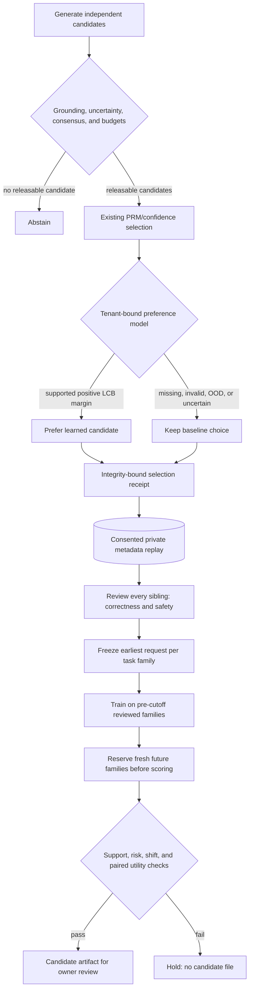

# Learning which verified candidate to prefer

Confidence is useful, but it is not the same as correctness. When extra inference produces several answers, a confident candidate can still be worse than a less confident one. This upgrade adds a small preference model that learns from reviewed candidate pairs, then applies that preference **only after the existing release checks**.

This is a metadata reward model, not an LLM judge, a text cross-encoder, or DPO fine-tuning. It deliberately avoids retaining generated answer text. The existing post-training pipeline remains the place for reviewed text-based SFT/DPO work.



## What the model learns

A safe, correct reviewed answer is preferred over an incorrect or unsafe sibling. A bootstrapped Bradley–Terry logistic model learns these pairwise differences. Seven members train on resampled **families**, and each family contributes equal weight even when it has more candidate pairs.

The four features are confidence, log estimated output length, log observed latency, and confidence × length. Feature scaling, support bounds, and weights use training data only. Selection flags, tenant/request IDs, reviewers, labels, timestamps, answer fingerprints, and content are not model features. Scores are relative preferences, **not calibrated probabilities of factual correctness**.

Runtime selection requires an existing releasable baseline. The learned winner replaces it only when its mean pairwise score improvement minus twice the ensemble standard deviation is at least 0.1. Unsupported route/risk combinations, out-of-bounds features, uncertainty, invalid artifacts, and missing identity preserve the baseline. The bootstrap lower bound is a conservative heuristic, not a statistical coverage guarantee.

The decision records the artifact fingerprint, baseline and selected candidate IDs, score summaries, and margin inside the sealed deliberation receipt. Old receipts without the optional extension still verify. The ranker adds no provider calls and does not increase candidate generation budgets.

## Honest evaluation boundaries

The replay retains all selection-evaluated candidate metadata, but it does not retain every original conformal/consensus eligibility decision or PRM score. Offline comparisons therefore use **fully reviewed, grounded pools** and a confidence-first metadata baseline. They do not claim improvement over the full live PRM selector or measure end-to-end release quality. Runtime still uses the full safety-filtered pool and the original PRM baseline.

Pools with missing or ambiguous reviews are excluded as a whole; the evaluator cannot cherry-pick a reviewed sibling. This complete-case sample can still differ from real traffic, so excluded pools must be investigated. The earliest request is fixed before examining labels. Repeated families cannot appear in both training and testing. Training labels must exist by the cutoff; new test families must first appear after the embargo. Current source fingerprints are checked before every evaluation, including cached retries.

The gate requires at least 20 contrasting training families per supported route/risk scope and 20 test families per evaluated scope. It checks a Wilson 95% upper error bound ≤20%, ≥80% feature-supported test pools, ≥20% reranked pools, zero selected unsafe answers, and a nonnegative paired bootstrap lower utility bound. Utility is +1 for safe correctness and −4 otherwise. All resampling uses families, not sibling answers. These are reference thresholds, not a production safety guarantee; 20 observations is a minimum control check, not proof of generalization.

The same private holdout ledger used by prospective calibration reserves test families **before scoring**. Exact completed retries reuse evidence; another study, artifact key, or overlapping calibration evaluation cannot quietly reuse those test families. An interrupted pending reservation requires operator audit. Protect the signing keys and ledger: deleting/replacing the ledger or authoring forged records with its key bypasses this operator control. Earlier training exposure by unrelated systems is not tracked.

## Try the credential-free control drill

```powershell
python -m evals.preference_evaluation drill --require-gate
```

The authored fixture has 40 training and 40 future test families. It counterbalances short and long preferred answers, so “always choose shorter” is not sufficient. The confidence-only baseline selects 20/40 correctly; the learned selector selects 40/40 and changes 20 choices. A length-shifted test fixture falls back and fails the gate. These results demonstrate learning and control flow on synthetic correlations—not factuality, live traffic lift, or provider cost savings. Synthetic artifacts cannot be activated in the research runtime.

## Train from your reviewed execution data

Enable consented replay as described in [execution feedback](execution-feedback-calibration.md). Assign a task-family ID before execution and review **every captured candidate**, including unselected siblings. Use the same existing review CLI; unsafe answers are treated as negative preferences even when their correctness label is positive.

Set `EXECUTION_REPLAY_KEY` and a separate `PREFERENCE_RANKING_KEY` locally. Both require at least 32 bytes. Freeze a fresh family-separated cohort, then evaluate once:

```powershell
python -m evals.preference_evaluation --tenant YOUR_TENANT freeze --cutoff UTC_UNIX_SECONDS --embargo-seconds 3600 --output data/execution-replay/preference-cohort.json
python -m evals.preference_evaluation --tenant YOUR_TENANT evaluate data/execution-replay/preference-cohort.json --candidate data/evaluations/preferences/candidate.json --output data/evaluations/preferences/report.json --require-gate
```

Failed gates produce a report but no new candidate artifact. Output files are immutable; exact retries are allowed, and changed evidence requires fresh paths. The CLI protects the replay, SQLite sidecars, ledger, input cohort, and configured active artifact from output aliasing. Private metadata, cohorts, models, and reports stay under Git-ignored `data/` paths.

After reviewing the report and artifact, the owner can set `PREFERENCE_RANKING_PATH` to that candidate, enable `PREFERENCE_RANKING_ENABLED=true`, and restart the service. Nothing auto-deploys. An artifact is bound to one authenticated tenant and its supported route/risk scopes; other tenants fall back. Disable the flag to roll back. A multi-tenant artifact registry, richer reviewed features, genuine live-model holdouts, and shadow deployment remain future work.
