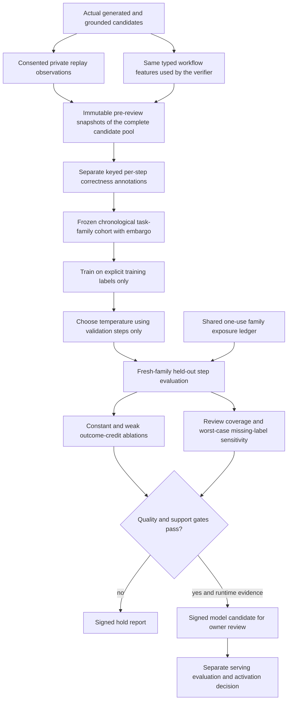

# Independent workflow supervision

A failed answer does not mean every preceding step was wrong. Retrieval may have worked while the
citation check failed. This upgrade lets a reviewer label those checks separately, then measures
whether a small verifier learns useful distinctions on later task families.

It also fixes a leakage bug in the older plan-review exporter. Previously a terminal safety label
became every step's target and even determined citation and policy input features. Now that exporter
keeps terminal labels as weak outcome-credit supervision only. It leaves step labels unset, omits
ambiguous reviews, and never constructs features from labels.

## How the new path works



The captured steps are **workflow proxies**, not chain-of-thought: retrieval evidence availability,
a reason proxy carrying grounding confidence, citation verification, and final-answer grounding confidence.
The runtime records the same features it gives its process verifier. It does not reconstruct hidden
reasoning, retain prompts or answers, or make additional model calls. Capturing data cannot change
the selected answer; a storage failure leaves the existing serving workflow intact.

All four proxies are derived from the candidate's final grounding report. They are not instrumented
intermediate reasoning states or a sequence of actual tool executions. This distinction limits what
the resulting model can learn and what a reviewer can label meaningfully.

Metadata alone cannot establish semantic correctness. Reviewers must consult the original request
and evidence through an authorized, separate review workflow and judge each check independently.
Do not infer all step labels from the terminal result or from the verifier's own confidence.

## Collection and review

Collection is disabled by default. Enable it locally with replay enabled and an independent secret
of at least 32 bytes for each key. Real keys belong in an ignored environment file or secret manager.

```dotenv
EXECUTION_REPLAY_ENABLED=true
PROCESS_SUPERVISION_ENABLED=true
# Set EXECUTION_REPLAY_KEY locally.
# Set PROCESS_SUPERVISION_MODEL_KEY locally; it must differ from the replay key.
```

Each request needs a tenant `user_id`, strict `execution_replay_consent=true`, an
`execution_replay_request_id`, and a pre-execution `execution_replay_task_family`. Similar or repeated
tasks must share a family. Candidate snapshots are bound to the original signed observation and
family record. Raw step IDs and reviewer identities are not stored; reviewers are keyed identifiers.

```bash
python -m evals.process_supervision_evaluation --tenant TENANT queue --limit 20
python -m evals.process_supervision_evaluation --tenant TENANT review EVENT_ID \
  --step-index 0 --verdict correct --reviewer REVIEWER_ID
```

Step indexes are zero-based. Verdicts are `correct`, `incorrect`, or `ambiguous`; reviews are immutable
with exact retries allowed. Capture the entire pool before any terminal or step review. An incomplete
pool is rejected at cohort freeze rather than silently selecting only the reviewed candidates.
Unlabelled and ambiguous steps remain present in the cohort but do not enter explicit-label training.

## Training and evaluation

Choose chronological train and validation cutoff timestamps in UTC Unix seconds. Freeze happens
at the current time. The embargo excludes boundary families, earliest family appearance fixes its
fold, and repeat requests cannot move a previously seen family into the test set. Labels unavailable
at a fold's cutoff are not used. The cohort includes families with captured workflow snapshots;
it is not an estimate over all traffic or uncaptured requests.

```bash
python -m evals.process_supervision_evaluation --tenant TENANT freeze \
  --train-cutoff TRAIN_UTC_SECONDS --validation-cutoff VALIDATION_UTC_SECONDS \
  --embargo-seconds 3600 --output data/process-supervision/cohort-v1.json
python -m evals.process_supervision_evaluation --tenant TENANT evaluate \
  data/process-supervision/cohort-v1.json \
  --candidate data/process-supervision/candidate-v1.json \
  --output data/process-supervision/report-v1.json --require-gate
```

The learner is the existing transparent logistic process-reward model. Only independently labelled
training steps provide targets. Validation steps choose a calibration temperature; neither terminal
outcomes nor held-out labels tune its stopping threshold. The held-out report includes:

- family-macro Brier score and step-weighted ten-bin calibration error;
- a training-label constant baseline and a clearly weak terminal-outcome-credit ablation;
- paired family-bootstrap lower bounds against the constant baseline;
- label support, route/risk family support, review coverage, and worst-case Brier/paired-delta bounds
  that retain every missing or ambiguous test step instead of assuming it is correct.

The gate requires at least 20 training, 10 validation, and 20 test families with explicit reviews; five positive and five
negative labels in each fold; ten test families per route/risk scope; 80% test-step review coverage;
Brier and ECE at most 0.2; and nonnegative paired improvement lower bounds. Worst-case missing-label
Brier must also be at most 0.2. These are engineering defaults, not a guarantee of calibrated risk.

Test families are reserved in the shared holdout ledger **before scoring**, including unreviewed
families. Completed exact retries return the signed cached result. Other experiments cannot reuse
those families. Interrupted studies remain exposed and require operator audit; deleting a tenant's
replay data does not reset exposure. Source deletion or tampering blocks later cached reuse.

This controls repeat evaluation, not all researcher discretion. Cutoffs are owner-selected rather
than preregistered before collection. Keep a separate study plan and fresh final holdout to avoid
selecting cutoffs, family definitions, or features after inspecting labels. A local ledger also
depends on disciplined storage/key management; resetting it defeats its guarantees.

Outputs are immutable and active verifier/storage paths are protected. Use new output names for
new cohorts. Candidate files are signed wrappers containing a calibrated model, tenant binding,
cohort/report fingerprints and provenance. They are **not directly loadable serving artifacts**.
Nothing extracts the model, alters an ensemble, renews approval, or activates it automatically.
Before any owner activation, evaluate final-answer quality, selective coverage/risk, and live shift
behavior on a separate fresh cohort. Step prediction alone is not enough.

The next stage is now implemented as [non-serving verifier shadow validation](verifier-shadow-validation.md).
It preregisters a model and primary threshold, compares selections on the actual generated pool, and
evaluates delayed terminal outcomes without changing answers or activating the candidate.

Private SQLite data and generated files under `data/` are ignored by Git. Tenant deletion removes
workflow snapshots and annotations from replay storage. Previously exported cohort/candidate files
need their own retention/deletion policy; they are not automatically erased with the database rows.

## Reproduce the controls

```bash
python -m evals.process_supervision_evaluation drill --require-gate
python -m pytest -q tests/test_process_supervision.py tests/test_process_reward.py tests/test_verifier_ensemble.py
```

The credential-free drill uses 20/10/20 synthetic families with two candidates each. It compares
explicit supervision with constant and weak outcome-credit training, then holds both a 50%-reviewed
test cohort and an inverted-label shift. Synthetic labels never count as human-labelled steps or
produce a production-ready candidate. CI runs the drill and uploads its report.

| Synthetic cohort | Reviewed-step Brier | Worst-case Brier including missing reviews | Gate |
|---|---:|---:|---|
| Complete reviews | 0.0014 | 0.0014 | Pass controls only |
| 50% reviewed | 0.0014 | 0.4870 | Hold |
| Inverted test labels | 0.9726 | 0.9726 | Hold |

On the complete-review seed, the training-label constant baseline scores 0.1875 and weak terminal
outcome-credit training scores 0.2182. Lower Brier is better. The sparse-review row shows why a good
score on reviewed examples alone is insufficient: the missing-label bound reverses the conclusion.

The synthetic template deliberately makes correctness learnable from workflow features. Its strong
score demonstrates the mechanism, not generalization, recruiter-ready benchmark results, or a
measured improvement in live answers. The useful interview story is the leakage diagnosis, separation
of features and labels, time-aware evaluation, and refusal to activate a model on insufficient evidence.
