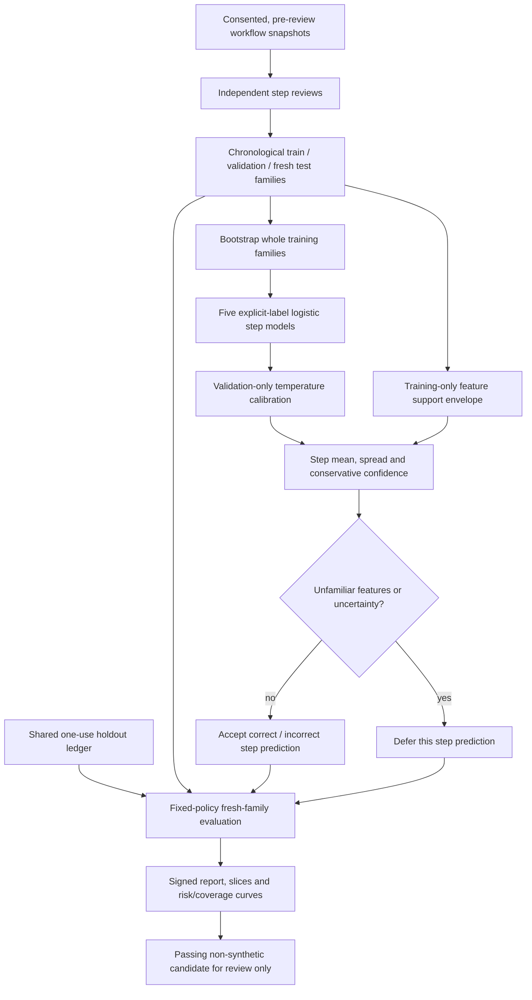

# Knowing when the verifier should stop trusting itself

The reviewed process model already learns from independent step annotations. That still leaves a
practical question: what happens when its workflow features change, or several plausible fitted
models disagree? A single high score doesn't answer either question.

This upgrade adds an offline **step-level** ensemble, training-feature support checks, and a
fresh-family risk/coverage evaluation. It consumes the existing consented workflow snapshots and
independent reviews. It makes no additional generation calls and changes no served answers.



## What actually gets learned

Each bootstrap draw samples a training **task family**, then includes every candidate trace from
that family. Sibling answers never become independent bootstrap units. Repeated draws repeat the
whole family. The underlying logistic fit still weights explicit steps using the existing temporal
weights; it is not a family-balanced training loss.

Missing and ambiguous reviews contribute no training targets. Final-answer quality and safety
labels are not converted into step labels, and they do not tune calibration. Each member has the
same 12 typed proxy features used by the reviewed process model.

One temperature is chosen on validation labels only, minimizing family-macro Brier loss of the
mean calibrated member prediction. The scorer returns a mean and population standard deviation
across calibrated member predictions for each step. Its conservative confidence is:

`max(0, max(mean, 1 - mean) - 1.5 * spread)`

A confident prediction can mean either **correct** or **incorrect**. Accepting a step prediction
does not mean accepting an answer. This is deliberately not the legacy trajectory scorer, whose
calibration uses weak terminal outcomes. The new artifact cannot be loaded as either existing
serving model schema.

## Agreement is not enough

The guard remembers training-only categorical patterns: step kind, evidence, citation validity,
policy permission, execution error and high-risk status. For each pattern it stores the observed
progress and confidence ranges. An unseen pattern or a range miss beyond the fixed 0.05 margin
defers the prediction, even if every member agrees.

This is an observed-feature envelope, not semantic OOD detection. It cannot detect an unfamiliar
question whose typed features resemble training data. Ranges can also admit combinations never
observed jointly. Caller-provided family IDs still need a sensible near-duplicate grouping policy.
Route/risk slices are evaluated separately; route itself is not a model input or support key.

## What the evaluation can—and cannot—say

Only the fixed primary policy gates review: confidence at least 0.8, spread at most 0.15, and
supported features. The five confidence thresholds produce descriptive curves, not a menu for
choosing the best test result. Changing the policy or model key after evaluation needs fresh test
families in the same ledger. The local ledger cannot stop an owner inspecting exported labels or
creating an alternate ledger; protect both the database and its keys.

The gate requires at least 20 reviewed training families, 10 validation families and 20 test
families, with at least five labels of each class in every fold. Test review coverage must reach
80%. Worst-case family-macro Brier and step-weighted ECE must be at most 0.2, and the worst-case
paired Brier-improvement bootstrap lower percentile versus the training-label constant must be
nonnegative. A separately calibrated single explicit-label model is an ablation, not an assumed
inferior baseline.

At the primary policy, overall and each route/risk slice need at least 50% step-prediction coverage,
80% accepted-step review coverage, enough reviewed accepted families (20 overall, 10 per scope),
and a worst-case family-macro error bootstrap upper percentile at most 0.2. Step-kind slices are
reported descriptively; they are not separate gates. A fully deferred slice has unknown risk,
not zero error. Missing or ambiguous accepted-step reviews count as errors in the worst case.

Errors are averaged within family and then across families. The 1,000-replicate family bootstrap
preserves clustering; treating hundreds of sibling steps as independent would inflate support.
Its 95th percentile is **descriptive**, not a finite-sample population risk guarantee: with no
observed errors it can be zero. Spread and conservative confidence are also heuristics, not
conformal intervals or a proof of epistemic uncertainty. These gates admit an artifact for review;
they do not authorize deployment.

The evaluator reserves all test families before score calculation. Exact completed retries use
the signed cache after live source revalidation. Deleting or changing original observations,
workflow snapshots or relevant reviews revokes reuse. Failed or interrupted studies remain
exposed. Reuse the shared replay ledger; don't reset it to get a better result.

## Run it

The credential-free control drill is the easiest first review:

```bash
python -m evals.reviewed_verifier_uncertainty_evaluation drill --require-gate
python -m pytest -q tests/test_reviewed_verifier_uncertainty.py
```

For reviewed runtime data, keep the existing replay capture and workflow supervision enabled
with explicit consent. Use `agentforge-process-supervision` to review and freeze a new cohort.
Do not reuse a test fold already exposed by process-model training, verifier shadows or another
study. Set the private `EXECUTION_REPLAY_KEY` and independent `PROCESS_SUPERVISION_MODEL_KEY`
through your environment; never put them in a command or commit them.

```bash
python -m evals.reviewed_verifier_uncertainty_evaluation \
  --store data/execution-replay/replay.sqlite3 \
  --ledger data/execution-replay/holdout-ledger.sqlite3 \
  --tenant owner-tenant evaluate data/process-supervision/fresh-cohort.json \
  --output data/process-supervision/step-uncertainty-report.json \
  --candidate data/process-supervision/step-uncertainty-candidate.json \
  --require-gate
```

An optional `--policy policy.json` accepts the strict typed policy; its version, bounded parameters
and sorted unique confidence grid are validated. Fix it before evaluating. Without that option,
the defaults above apply. The installed entry point is `agentforge-reviewed-verifier-uncertainty`.

Output paths are immutable and cannot alias inputs, active verifier paths or replay/ledger SQLite
files and sidecars. Runtime evaluation refuses synthetic cohorts. Only a passing non-synthetic
report exports a candidate; even then `production_activation` is false. Private local artifacts
belong under the already ignored `data/process-supervision/` or `data/evaluations/` directories.
Exported files need their own retention policy; deleting a tenant does not erase copies.

## Review the controls honestly

The authored fixture uses 20 training, 10 validation and 20 test families, each with two candidate
workflows and four steps. It is intentionally repetitive. The clean ensemble and single explicit
model have effectively identical Brier loss (about 0.00136); this is **not an ensemble accuracy
win**. It is evidence that the training, calibration and holds are wired correctly.

| Control | Expected behavior |
|---|---|
| Complete independent reviews | Pass the synthetic control gate; never export a production candidate |
| 50% test review coverage | Hold; unknown reviews worsen conservative metrics |
| Inverted test step labels | Hold despite high model confidence |
| Previously unseen high-risk flag | Four predictions deferred; an unguarded ensemble accepts all four |

Tests also introduce heterogeneous training-family labels to check that bootstrap members can
diverge and that spread lowers confidence. Broader human-reviewed data is still needed to show
whether the ensemble beats a single model or whether deferral improves useful downstream work.

The 30 new tests passed locally. Focused branch coverage measured 97% for the learner/scorer and
94% for the offline evaluator (96% combined). On this Windows/Python 3.13 installation, coverage
tracing during existing native dependency imports crashed; loading those dependencies before
starting focused tracing allowed the measurement. No dependency pins or runtime settings were
changed to work around it. The normal Linux/Python 3.11 CI retains its full-suite coverage run.
The full repository run on this iteration finished with 453 tests passed and two Docker-dependent
tests skipped because the local engine/image was unavailable. Repository-wide Ruff, compilation,
the control CLI gate and the five-case retrieval smoke check also passed (recall@8 and MRR 1.0).

For a resume, an accurate claim is: “Built family-bootstrap, independently supervised verifier
ensembles with validation-only calibration, training-feature support guards, signed lineage,
fresh-family holdout controls, and missing-review-aware risk/coverage evaluation.”

There is no runtime activation flag for this artifact. Before any future serving integration,
evaluate a preregistered mapping from these **step** predictions to final-answer decisions on new
terminal outcomes. The existing [verifier shadow workflow](verifier-shadow-validation.md) shows
the required evaluation discipline, but its current model schema does not accept this artifact.
