# Learning a smaller policy from search

The full planner can explore several action sequences before it chooses a path. A small policy can
learn from that work and suggest which branch to explore first on future requests. This is the
purpose of search policy distillation in AgentForge.

The teacher runs 96 MCTS iterations on 35 authored training states and 35 separate validation states.
Its root action visits become probability targets. A linear softmax head learns these targets using
masked cross entropy. Validation KL selects the checkpoint. Test scenarios are loaded only after
training, and the trainer rejects test rows and overlapping train/validation contexts.

```mermaid
flowchart LR
    Grid[Training and validation state grid] --> Teacher[96-iteration MCTS teacher]
    Teacher --> Visits[Legal-action visit distributions]
    Visits --> Train[Masked cross-entropy training]
    Train --> Validate[Checkpoint selected by validation KL]
    Validate --> Artifact[Small policy with teacher lineage]
    Artifact --> Priors[Action probabilities]
    State[Evidence, risk, budget and available tools] --> Priors
    Priors --> PUCT[Bounded PUCT search]
    Priors -->|unknown route or high entropy| Uniform[Uniform priors]
    Uniform --> PUCT
    PUCT --> Audit[Independent action replay and receipt checks]
    Frozen[Frozen test scenarios] --> Curves[8, 16, 32 and 96 iteration ablations]
    Audit --> Curves
    Curves --> Gate[Quality, safety and budget promotion gate]
```



The input includes confidence, evidence, reasoning and verification state, risk, available tools,
remaining tokens, remaining retrievals, route, and the planner's legal action mask. The student
returns probabilities only for those legal actions. It guides PUCT selection and expansion; the
planner continues to enforce evidence, verification, token, depth and terminal-answer constraints.

Unknown routes and high normalized policy entropy produce uniform priors. Plans record the student
artifact fingerprint, fallback count, maximum entropy and distinct reward evaluations. Artifact
loading verifies the weights and fingerprint, and planner construction rejects a different teacher
scorer. Missing artifacts and conflicting offline-RL/student flags lead to the existing abstention
path in adaptive compute. The two learned prior methods are selectable alternatives.

## What the current measurement says

On the ten frozen synthetic search scenarios, student validation KL is `0.0142`, compared with
`0.1809` for uniform priors. Both uniform UCT and distilled PUCT achieve 100% scenario success at all
four tested iteration budgets, with no unsafe action sequences or token-budget violations.

At 32 iterations, distilled PUCT uses 3.6 distinct reward evaluations per case versus 4.2 for uniform
UCT, a 14.3% reduction. It expands 6.2 nodes versus 7.0. At eight iterations it uses 2.7 distinct reward
evaluations versus 2.8, but expands more nodes (4.9 versus 4.4). The report exposes these trade-offs,
a Pareto front, and the minimum tested iteration budget that matches teacher quality.

Both methods already match teacher quality at eight iterations. The report therefore records zero
iteration savings over uniform search on this corpus. Distinct score evaluations are deterministic
operations in the local planner, not provider calls; wall-clock latency, LLM token savings and
live-model quality have not been measured. This small authored task set cannot establish broad
generalization. A stronger study would freeze a larger collection of observed tasks, preserve task
family separation, and compare repeated runs with measured latency and provider usage.

## Run the study

```bash
python -m evals.distillation_evaluation --require-promotion
```

The command writes the teacher examples, selected policy and full compute curve to
`data/evaluations/distillation/`. CI runs the same promotion gate and uploads these artifacts.
Promotion requires better validation KL than uniform priors, no safety/budget/integrity failures,
no success regression at any tested budget, and teacher-quality completion at a tested budget.

## Enable student priors

```dotenv
GROUNDING_VERIFICATION_ENABLED=true
ADAPTIVE_COMPUTE_ENABLED=true
VERIFIER_MCTS_ENABLED=true
PROCESS_REWARD_MODEL_PATH=evals/experiments/process_reward_model.json
SEARCH_DISTILLATION_ENABLED=true
SEARCH_DISTILLATION_PATH=data/evaluations/distillation/policy.json
OFFLINE_RL_POLICY_ENABLED=false
```

Use the same process reward artifact used to generate the teacher data. The default study trains
with heuristic action transitions and the checked-in single process reward model. Other verifier
ensembles and learned world-model combinations require their own teacher generation and ablation
before their results can be compared with this study.
