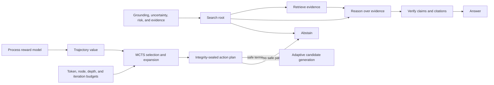

# Verifier-guided reasoning search

Generating more answers is useful only when the system can decide which reasoning path is
worth paying for. AgentForge therefore adds a bounded Monte Carlo tree search (MCTS) controller
between the uncertainty gate and adaptive deliberation. It searches over typed actions rather
than free-form chain-of-thought: retrieve, reason, verify, answer, or abstain.



## What the controller changes

The earlier controller made one policy decision: early exit, deliberate, or abstain. The search
controller handles the next level down. For a deliberation request it explores alternative action
sequences, uses UCT to balance exploitation and exploration, and asks the learned process reward
model to value complete trajectories. Confidence and compute cost are part of the terminal value;
they are not enough by themselves to bypass safety rules.

An answer is reachable only after reasoning and verification, with at least one evidence item for
ordinary requests and two for high-risk requests. Unsupported answers are removed from the action
space. If verification is unavailable, evidence is missing, or the remaining token budget cannot
complete a safe path, abstention wins. Search is capped by iteration, node, depth, and token budgets,
so it cannot become an open-ended reflection loop.

At runtime, the research graph invokes search after retrieval and initial grounding. It therefore
plans over the evidence already present and selects a reason/verify/answer or abstain path; it does
not silently trigger another external retrieval call. The offline evaluator additionally exercises
retrieval actions so the same planner can be measured before a future graph-level retrieval loop is
enabled.

## Replay and integrity

Every plan records the policy and request fingerprints, PRM artifact fingerprint, selected actions,
predicted value, planned tokens, expanded nodes, unique states, pruned unsafe and over-budget
branches, and root-action visit statistics. A SHA-256 plan fingerprint covers the complete receipt.
The adaptive-compute plan embeds that fingerprint and is resealed, which makes a changed action,
budget, or model reference detectable before candidate generation.

The planner fails closed if its model artifact is missing or modified, if its receipt fails
verification, or if it cannot find a safe terminal answer.

## Reproduce the ablation

```bash
python -m evals.search_planning_evaluation \
  --process-reward-artifact evals/experiments/process_reward_model.json \
  --check evals/experiments/search_planning.report.json \
  --output data/evaluations/search-planning/latest.json \
  --require-promotion
```

The checked-in ten-scenario holdout compares a fixed confidence threshold with verifier-guided
search. On this synthetic control-plane drill, baseline success is 30% and search success is 100%;
unsafe releases fall from 30% to 0%, all four recoverable failures are recovered, and no path exceeds
its token budget. CI reproduces the exact report and rejects metric or fingerprint drift.

These results validate planner mechanics, safety constraints, accounting, and reproducibility. They
do not show that the PRM or action model generalizes to real model failures. A production claim needs
human-reviewed traces, live retrieval outcomes, measured provider tokens and latency, multiple random
seeds where transitions are stochastic, and a frozen private holdout.

## Enable it

Generate the process-reward artifact first, then enable grounding, adaptive compute, and search:

```dotenv
GROUNDING_VERIFICATION_ENABLED=true
ADAPTIVE_COMPUTE_ENABLED=true
PROCESS_REWARD_MODEL_ENABLED=true
PROCESS_REWARD_MODEL_PATH=data/evaluations/process-reward/model.json
VERIFIER_MCTS_ENABLED=true
VERIFIER_MCTS_ITERATIONS=96
VERIFIER_MCTS_MAX_NODES=128
```

The search flag is independent so teams can compare policy-only and search-guided deliberation under
the same runtime and evaluation harness.

The optional [uncertainty-aware verifier ensemble](verifier-uncertainty.md) replaces the point
reward with a calibrated lower confidence bound and makes OOD answer branches fail closed.

The optional [learned world model](learned-world-model-planning.md) replaces fixed confidence and
evidence increments with action-conditioned transition distributions, transition-success estimates,
and a separate dynamics OOD gate.

The optional [conservative offline-RL policy](conservative-offline-rl-planning.md) replaces uniform
tree priors with safety-masked Q-value lower bounds and PUCT, while retaining uniform priors as the
OOD fallback.
