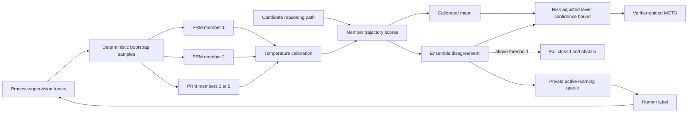

# Uncertainty-aware verifier ensemble

A learned verifier can be confidently wrong. That failure is especially dangerous when the same
score controls search, candidate ranking, and release. AgentForge can therefore replace the single
process-reward model with a calibrated bootstrapped ensemble and use disagreement as epistemic
uncertainty.



## Training and calibration

Each member is trained on a deterministic bootstrap sample of the process-supervision training
split. The members share the same content-free feature schema but see different empirical
distributions. A disjoint validation split selects a temperature by Brier score and derives the
maximum expected disagreement threshold. The resulting artifact contains every sealed member,
calibration parameters, dataset fingerprint, and an outer integrity fingerprint.

At inference time the ensemble returns four values: calibrated mean reward, member standard
deviation, a lower confidence bound, and an out-of-distribution decision. High-risk paths receive a
larger uncertainty penalty. MCTS optimizes the lower confidence bound—not the mean—and makes answer
branches unavailable when the ensemble is out of distribution. Candidate reranking also receives
the conservative score through the existing PRM interface.

This separates aleatoric confidence in an answer from epistemic uncertainty in the verifier itself.
The distinction matters: more search cannot repair a verifier that no longer knows whether its own
score is reliable.

## Active learning without prompt storage

Uncertain and OOD plans can be written to a transactional SQLite review queue. Records contain only
request, model, and plan fingerprints; route and risk metadata; typed action names; evidence count;
and aggregate verifier statistics. Prompt text, answer text, retrieved passages, tool output, and
chain-of-thought are never stored.

Events are deterministically deduplicated. Human labels are limited to `safe`, `unsafe`, or
`ambiguous`, and reviewer identities are stored only as hashes.

```bash
agentforge-verifier-review list --limit 20
agentforge-verifier-review review EVENT_ID --label ambiguous --reviewer reviewer@example.com
agentforge-verifier-review stats
agentforge-verifier-review export --output data/verifier-review/reviewed-traces.jsonl
```

The export converts typed actions and aggregate metadata into `human_reviewed` process traces with a
fixed redacted query marker. Those traces can enter the next training cycle without reconstructing or
retaining user content.

## Reproduce the shift ablation

```bash
python -m evals.verifier_uncertainty_evaluation \
  --artifact data/evaluations/verifier-uncertainty/ensemble.json \
  --output data/evaluations/verifier-uncertainty/report.json \
  --check-artifact evals/experiments/process_reward_ensemble.json \
  --check-report evals/experiments/verifier_uncertainty.report.json \
  --require-promotion
```

The ten-scenario synthetic holdout pairs five clean groups with five controlled model-shift cases.
The shift drill replaces one ensemble member with a validly sealed but behaviorally inverted model,
simulating a bad retrain or compromised artifact that checksum validation alone cannot detect. The
single-member policy selects unsafe trajectories in all shifted cases. The ensemble preserves 100%
clean selective accuracy, detects and contains all shifted cases, records zero shifted unsafe
selections, and sends every shift to review. CI retrains the ensemble and compares both the artifact
and report exactly with the checked baselines.

These are mechanism tests over a small synthetic seed. Five members and three calibration examples
are deliberately lightweight for reproducible CI; they are not enough for a production uncertainty
claim. A deployed system needs diverse human-reviewed traces, more bootstrap members or deep
ensembles, route-specific calibration, temporal shift data, and live-model latency/cost measurement.

## Enable it

```dotenv
PROCESS_REWARD_MODEL_ENABLED=true
VERIFIER_MCTS_ENABLED=true
VERIFIER_ENSEMBLE_ENABLED=true
VERIFIER_ENSEMBLE_PATH=data/evaluations/verifier-uncertainty/ensemble.json
VERIFIER_ACTIVE_LEARNING_ENABLED=true
VERIFIER_ACTIVE_LEARNING_PATH=data/verifier-review/verifier-review.sqlite3
VERIFIER_REVIEW_UNCERTAINTY_THRESHOLD=0.08
```

The ensemble and review queue are opt-in so the single-verifier baseline remains available for
controlled ablations.
