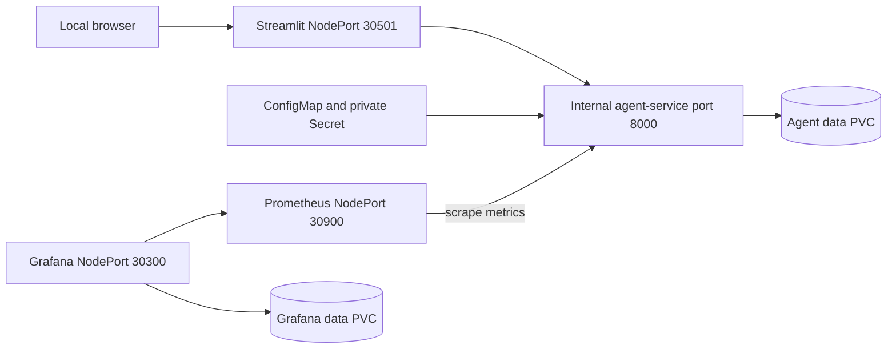

# Local Kubernetes deployment

These manifests run the research API, Streamlit UI, Prometheus, and Grafana in the `agent-platform` namespace. They are a local reference deployment, not a complete production cluster configuration. Run the commands below from the repository root.

Unlike [Docker Compose](../compose.yaml), this stack uses one API replica with SQLite-backed checkpoints/store and embedded retrieval persistence. It does not deploy PostgreSQL, Redis, a coding worker, or evaluation dashboards. Advanced AI controls and coding execution remain disabled in the supplied ConfigMap; no trained model or calibration artifact is installed by deployment.



## Before deploying

Use Docker Desktop with Kubernetes enabled, or a local cluster where you can load the built images. Check the target context before making changes:

```bash
kubectl config current-context
kubectl get nodes
kubectl get storageclass
```

The agent requests a 5 GiB `ReadWriteOnce` PVC and Grafana a 2 GiB PVC. A working default storage class is required. Keep the API at one replica for this shared SQLite reference setup; increasing replicas is not a distributed-storage upgrade.

Build the exact image tags referenced by the Deployments:

```bash
docker build -f docker/Dockerfile.service -t agent-service-toolkit/agent-service:local .
docker build -f docker/Dockerfile.app -t agent-service-toolkit/streamlit-app:local .
```

Docker Desktop can use local images when its cluster shares the image store. Other clusters may require an image import or a registry plus updated Deployment image references. `imagePullPolicy: IfNotPresent` can reuse an old local tag; use new tags for repeatable deployments rather than assuming a rebuild changed an existing pod.

## Create the private Secret

The committed [agent-secret.example.yaml](agent-secret.example.yaml) documents the expected names. It contains placeholders, is not included in Kustomize, and must not be edited to contain real values.

Create a private `.env.k8s` file at the repository root, using plain `NAME=value` lines. At minimum, supply a long random `USER_AUTH_SECRET`, at least one usable provider key (`OPENAI_API_KEY` or `GROQ_API_KEY`), and `GRAFANA_ADMIN_USER` / `GRAFANA_ADMIN_PASSWORD`. Do not leave placeholder signing secrets or passwords. The configured OpenAI embedding path separately needs OpenAI credentials if you ingest into it.

Verify the file is ignored before adding any secrets, and restrict access to it:

```bash
git check-ignore .env.k8s
kubectl apply -f k8s/namespace.yaml
kubectl -n agent-platform create secret generic agent-secrets --from-env-file=.env.k8s
```

This avoids putting secret values directly into command history. A Kubernetes Secret is not encryption by itself; cluster RBAC, encryption at rest, and a managed secret store are separate operational responsibilities. Do not print, commit, or upload the private file or Secret YAML.

`create secret` is the first-install command. If the Secret already exists, use your deliberate secret-rotation process instead of deleting it or replaying placeholder values. Pods consume these values as environment variables and need restarting after an intentional change.

Optional controls need their own independent keys and artifact mounts. The Secret template covers only a subset of current keys; consult [../.env.example](../.env.example) and the relevant subsystem guide before enabling replay, reviewed learning, or a shadow study. Their artifacts live under persistent private paths, not in ConfigMaps. Never enable all AI flags without satisfying their dependencies and mode restrictions.

## Apply and verify

```bash
kubectl kustomize k8s
kubectl apply -k k8s
kubectl -n agent-platform rollout status deployment/agent-service
kubectl -n agent-platform rollout status deployment/streamlit-app
kubectl -n agent-platform rollout status deployment/prometheus
kubectl -n agent-platform rollout status deployment/grafana
kubectl -n agent-platform get pods,svc,pvc
```

Rendering first helps catch configuration mistakes without deploying. The API probes `/healthz` and `/readyz`; Streamlit has its own health probe. Pod readiness is not evidence that model credentials work, a corpus exists, or an AI quality gate passed. Check those separately with an authenticated request and the relevant evaluation workflow.

| Local service | Address |
|---|---|
| Research UI | `http://localhost:30501` |
| Prometheus | `http://localhost:30900` |
| Grafana | `http://localhost:30300` |

Use the Grafana credentials from your private Secret. NodePort access depends on the cluster/node network; `localhost` is the Docker Desktop case. The API service is internal, not exposed through a NodePort. For local diagnostics you can use:

```bash
kubectl -n agent-platform port-forward service/agent-service 8000:8000
```

Then visit `http://localhost:8000/docs`. Port-forward reachability can depend on cluster networking and policy implementation.

## What the manifests configure

| Files | Responsibility |
|---|---|
| `namespace.yaml`, `kustomization.yaml` | Namespace and resource assembly; the real Secret is created separately |
| `agent-configmap.yaml`, `streamlit-configmap.yaml` | Non-secret API defaults and the in-cluster `AGENT_URL` |
| `agent-pvc.yaml`, `agent-deployment.yaml`, `agent-service.yaml` | API persistence, single-replica container, health probes, resources, and internal service |
| `streamlit-deployment.yaml`, `streamlit-service.yaml` | UI container, health probe, and NodePort |
| `prometheus-configmap.yaml`, `prometheus-deployment.yaml`, `prometheus-service.yaml` | API metrics scraping and Prometheus NodePort; no persistent Prometheus volume |
| `grafana-datasource-configmap.yaml`, `grafana-deployment.yaml`, `grafana-service.yaml` | Prometheus datasource, Secret-backed login, Grafana PVC, and NodePort |
| `network-policy.yaml` | API ingress from UI and Prometheus pods on port 8000 |

NetworkPolicy requires a supporting CNI. This policy is not an egress restriction or a sandbox network boundary. The API runs as a non-root user with dropped capabilities and no service-account token, but its root filesystem is writable in the current manifest. Do not describe this as the coding sandbox's read-only isolation.

For logs:

```bash
kubectl -n agent-platform logs deployment/agent-service --tail=200
kubectl -n agent-platform logs deployment/prometheus --tail=200
kubectl -n agent-platform logs deployment/grafana --tail=200
```

Keep logs private when diagnosing provider or user-data issues.

## Deployment boundaries and cleanup

The manifests do not mount the Docker socket. Coding tasks need a separately isolated worker with explicitly shared job/artifact storage and access to authorized repositories; setting `CODE_AGENT_ENABLED=true` alone does not provision one. See [the coding-agent guide](../docs/code-agent.md).

For a public deployment, plan ingress/TLS, reviewed network policies, managed secrets, backups, external PostgreSQL/Redis where needed, distributed limits, signed/scanned images, and stronger isolation for untrusted execution. The current stack does not provide these automatically.

Back up data and understand the storage class's reclaim policy before removing resources. Both commands below are destructive: the Kustomize deletion includes PVCs, and namespace deletion also removes the Secret and any other resources in that namespace. Depending on storage policy, persisted conversations, retrieval indexes, or Grafana data may be permanently lost.

```bash
# Only when intentionally discarding or after backing up this deployment:
kubectl delete -k k8s
# Optional final cleanup of the namespace and anything remaining inside it:
kubectl delete namespace agent-platform
```
